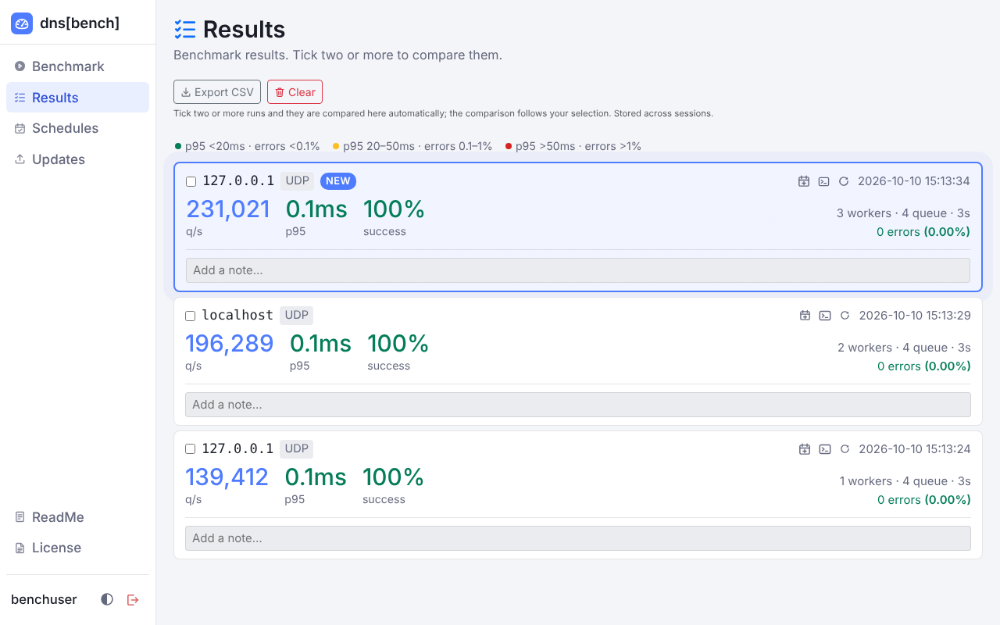
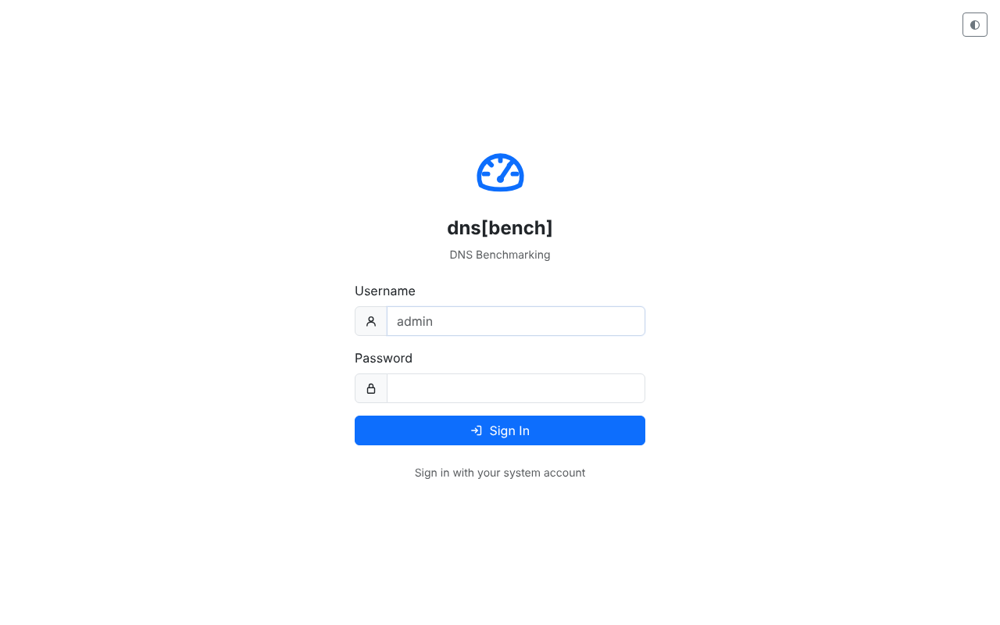
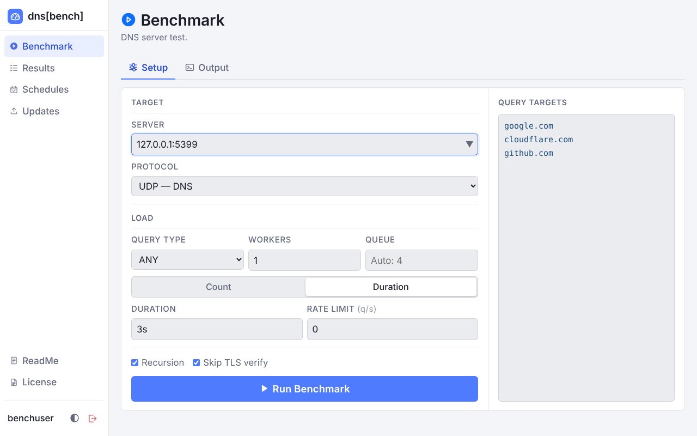
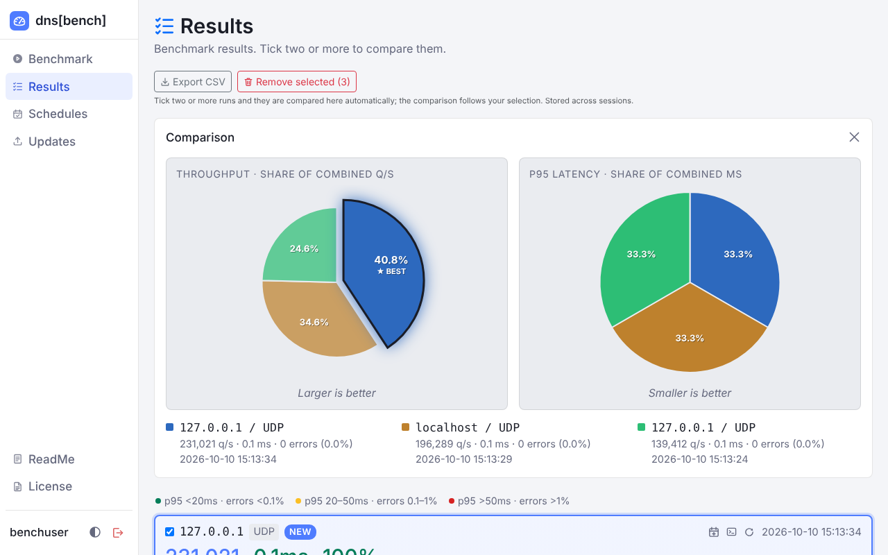
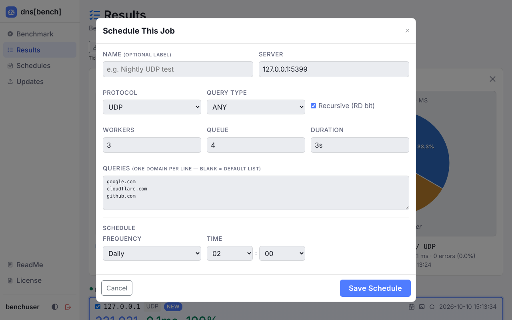
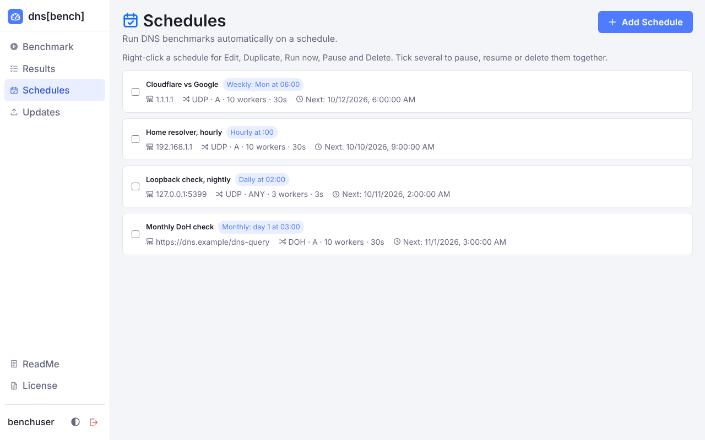
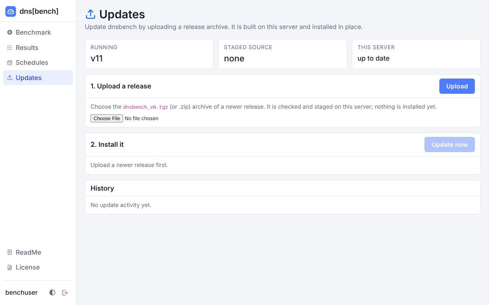

# dns[bench]

**Find out how fast a DNS server really is.**

dns[bench] throws DNS queries at any resolver and tells you how many it answered per second, how long the slowest ones took, and how many failed. You run it from a web page, or from curl if you prefer. You can save a test to repeat on a schedule, and you can put two or more results side by side to see which server is better.

It is a single program that you build and run on a Linux box. There is nothing to download from anywhere else and no outside code to trust: it uses only Go's standard library.



---

## What it can do

- **Test four kinds of DNS**: plain UDP and TCP, DNS over TLS (DoT), and DNS over HTTPS (DoH, with POST or GET, over HTTP/1.1 or HTTP/2).
- **Push UDP hard.** The UDP engine sends and receives in batches (`sendmmsg` and `recvmmsg`), so a single machine can generate a lot of load.
- **Watch it happen.** Output streams to the Output tab while a test runs. When it finishes, the Results page opens with your new run highlighted.
- **Keep a history.** Every run is saved with its throughput, errors and p95 latency. Tick two or more and they are compared automatically, as pie charts that change as you tick and untick. The best run in each chart is pulled out and outlined.
- **Run it again, or schedule it.** The circular arrow on a result repeats that test. The calendar icon opens the schedule editor, already filled in with that run's settings.
- **Schedule tests.** Hourly, daily, weekly, monthly or once, in the server's local time. Right-click a schedule to edit, duplicate, run, pause or delete it.
- **Update from the browser.** Upload a newer release on the Updates page and the server builds it, checks it starts, installs it and restarts. If the new version won't stay up, it goes back to the old one by itself.
- **Sign in with your Linux accounts**, through PAM, limited to the members of one group.
- **Light and dark themes** that follow your system setting.
- **A REST API** that does everything the web page does.

---

## Installing

You need a Linux machine with systemd. From the unpacked project folder, run:

```bash
sudo bash install.sh
```

The installer does five things:

1. Installs what it needs to build the program: a C compiler and the PAM development headers (it knows apt, dnf/yum and pacman). If your system has no Go 1.22 or newer, it also fetches the official Go toolchain, checks its checksum and uses it for this build only.
2. Compiles the source in `source/`.
3. Puts the program in `/opt/dnsbench/`, a default config in `/etc/dnsbench/dnsbench.conf`, a PAM service in `/etc/pam.d/dnsbench`, and the systemd unit in place.
4. Creates a `dnsbench` group and adds you to it. That means the person who ran `sudo`. Root is never added automatically.
5. Starts the service and checks that it answers. If an upgrade doesn't come up, it puts the old version back.

When it's done, open `https://your-server:8453` and sign in with your own account on that machine. The first start makes a self-signed certificate, so your browser will warn you once.



A few options are worth knowing. `--dry-run` shows what would happen without changing anything. `--no-start` installs but doesn't start the service. `--allow-downgrade` lets you install an older version over a newer one. You can run the installer again whenever you like to upgrade, and your config is kept.

---

## Running your first benchmark

Open **Benchmark**, type the address of the DNS server you want to test, pick a protocol, and press **Run Benchmark**. The defaults are sensible: workers and queue size are chosen from your CPU count, and the query list is three well-known names. Change the list on the right if you want to test with your own domains.



You can run for a set number of queries or for a fixed time, and you can cap the rate if you don't want to flood the server. The Output tab shows what's happening as it runs.

---

## Reading the results

When a run ends, the Results page opens. Each card shows the server, the protocol, queries per second, p95 latency (95% of answers were faster than this) and the success rate. The colours tell you at a glance how it went:

- **Green**: p95 under 20 ms and errors under 0.1%
- **Amber**: p95 between 20 and 50 ms, or errors between 0.1% and 1%
- **Red**: p95 over 50 ms, or errors over 1%

Every query that is sent is counted, and one that never gets an answer counts as an error. A dead server therefore shows up as errors and never as a run that looks successful.

To compare runs, tick two or more. The comparison appears on its own, and it follows your ticks. You can export everything as CSV, add a note to any run, and remove the ones you no longer want.



---

## Scheduling a test

The quickest way to schedule a test is to start from one that already ran. Press the calendar icon on a result and the schedule editor opens with the same server, protocol, workers and queries already filled in. Give it a name, choose when it should run, and press **Save Schedule**. Nothing is saved until you do.



You can also press **Add Schedule** on the Schedules page and start from a blank form. Schedules can run hourly, daily, weekly, monthly or once. Times are in the server's local time zone, and daylight saving changes won't make them drift. A monthly schedule set for the 31st runs on the last day of shorter months.



Right-click a schedule to edit, duplicate, run it now, pause it or delete it. Tick several to pause, resume or delete them together. The results of scheduled runs show up on the Results page too.

---

## Settings

Edit `/etc/dnsbench/dnsbench.conf`, which is plain `KEY=value` lines, then run `systemctl restart dnsbench`.

| Setting | Default | What it does |
|---|---|---|
| `LISTEN_HOST` | `0.0.0.0` | The address the web page and API listen on |
| `LISTEN_PORT` | `8453` | The port they listen on |
| `TLS_CERT`, `TLS_KEY` | blank | Your own PEM certificate and key. Blank means a self-signed one is made for you |
| `NO_TLS` | `false` | Serve plain HTTP. Only do this behind a proxy that handles TLS |
| `STATE_DIR` | `/var/lib/dnsbench` | Where the certificate and the schedules are kept |
| `SCHEDULES_FILE` | blank | Where schedules are stored. Blank means `STATE_DIR/schedules.json` |
| `PAM_SERVICE` | blank | The PAM service name. Blank means `/etc/pam.d/dnsbench` |
| `LOGIN_GROUP` | `dnsbench` | Only members of this group can sign in |
| `ALLOW_UPDATES` | `true` | Whether signed-in users can update dnsbench from the Updates page. `false` turns it off (see Updating from the web page). Anything other than `true` or `false` stops the service from starting |

Every setting also has a command-line flag (`--host`, `--port`, `--tls-cert`, `--tls-key`, `--no-tls`, `--state-dir`, `--schedules-file`, `--pam-service`, `--login-group`), and a flag beats the config file. `dnsbench --help` lists them all and `dnsbench --version` prints the version.

---

## HTTPS and certificates

If you leave `TLS_CERT` and `TLS_KEY` blank, dnsbench makes a self-signed certificate the first time it starts and reuses it from then on. It is valid for ten years and covers localhost, the machine's name and its addresses.

If you'd rather use your own, for example one from Let's Encrypt, point the config at it:

```ini
TLS_CERT=/etc/letsencrypt/live/bench.example.com/fullchain.pem
TLS_KEY=/etc/letsencrypt/live/bench.example.com/privkey.pem
```

When the certificate is renewed, dnsbench notices within about ten seconds and starts using it, with no restart. If the new files can't be read or are broken, it keeps serving the old certificate.

---

## Who can sign in

Signing in takes two things: the right password, and membership of the login group.

1. **The password** is checked by PAM, so any account that can log in to the machine qualifies. Expired and locked accounts are refused. The PAM service is called `dnsbench`. To check passwords some other way, such as LDAP or SSSD, edit `/etc/pam.d/dnsbench` and swap the two `pam_unix` lines for your site's setup.
2. **The group** is whatever `LOGIN_GROUP` names in the config, `dnsbench` by default. The installer creates it and adds the person who ran it.

The group is there on purpose. Anyone who can sign in can make this machine send DNS traffic anywhere, so being able to log in to the machine isn't enough.

To let someone in, or take them out:

```bash
sudo usermod -aG dnsbench alice        # let alice in
sudo gpasswd -d alice dnsbench         # take her out again
```

Membership is checked on every sign-in, so changes apply straight away and nothing needs restarting. People who are already signed in stay signed in until their session runs out or they sign out. Both a person's main group and their extra groups count, and with LDAP or SSSD the group can come from your directory. If you set `LOGIN_GROUP` to a group of your own, the installer leaves that group and its members alone and you look after them. If the group doesn't exist, nobody can sign in, and the service log says why.

Someone with the right password who isn't in the group sees the same "Invalid login attempt" message as someone with the wrong password. The real reason is only in the log (`journalctl -u dnsbench`), so a wrong password never reveals whether an account is in the group.

A few other things about sign-in:

- Eight failed attempts from one address within five minutes, counting refusals for group membership, block that address until the window passes (HTTP 429).
- A session lasts 60 minutes. It is extended automatically while one of that person's benchmarks is running.
- The cookie is `HttpOnly` and `SameSite=Strict`, and also `Secure` when TLS is on.
- Requests that change something are refused (HTTP 403) if the browser marks them as cross-site or they carry a foreign `Origin` header. Behind a reverse proxy, pass the original `Host` header through.
- Scripts can take the token from `POST /api/login` and send it in an `X-Session-Token` header instead of using the cookie.

If you can, also set `LISTEN_HOST` to a management address so the page isn't reachable from everywhere.

---

## Themes

The pages follow your system's light or dark setting. They switch when it changes, even while the page is open, and don't flash the wrong colours while loading. The theme button (bottom left in the app, top right on the sign-in page) cycles through Auto, Light and Dark. Your Light or Dark choice is remembered by that browser, and choosing Auto goes back to following the system.

## Does it need the internet?

Not at all. The web page, including its icons and charts, is built into the program and loads no fonts, scripts, styles or images from other sites, so it works on an isolated network. The REST API never needed the internet either.

Only the installer touches the network, and only to install missing build packages (a C compiler, the PAM headers and Go) through your package manager. Install those first, or set `DNSBENCH_SKIP_DEPS=1`, and it builds offline.

---

## Protocols

| Protocol | Default port | Notes |
|---|---|---|
| UDP | 53 | Sends and receives in batches. The `pipeline` setting is how many queries each worker keeps in flight |
| TCP | 53 | One lasting connection per worker, reopened if the server closes it |
| DoT | 853 | TLS over TCP. Certificates are checked against the host name you typed |
| DoH | 443 | POST or GET, HTTP/1.1 or HTTP/2, one connection per worker |

DNS over QUIC (DoQ) isn't supported. QUIC isn't in Go's standard library, and this project deliberately has no other dependencies.

You can write the server as `host`, `host:port` or `[ipv6]:port`. For DoH you can also give a full URL such as `https://dns.example/dns-query`. The name is looked up once when a run starts, and every worker connects to that address. For DoH the request goes to that address, while the name you typed is sent as the `Host` header and as the TLS server name, so certificate checks and virtual hosting behave just as if you had connected by name.

The server string is checked before anything is sent. The port must be a number from 1 to 65535, the host must be an IP address or a plain name (no `@`, `/`, `?`, `#`, spaces or other URL characters), and a DoH path must start with `/` and have no control characters. Anything else is refused with HTTP 400 and a message such as `invalid port` or `invalid server`, whether it was meant for a job or a schedule.

---

## The REST API

Everything the web page does is an HTTP call. Apart from login, every call needs a session, either the cookie or the `X-Session-Token` header.

### Logging in

```bash
BASE=https://localhost:8453
TOK=$(curl -sk $BASE/api/login -H 'Content-Type: application/json' \
  -d '{"username":"alice","password":"yourpassword"}' \
  | python3 -c "import sys,json; print(json.load(sys.stdin)['token'])")
```

A wrong password gets a 401, and an address that has been blocked gets a 429. `POST /api/logout` ends the session.

### Starting a benchmark

```bash
JOB=$(curl -sk $BASE/api/start-job -H 'Content-Type: application/json' \
  -H "X-Session-Token: $TOK" \
  -d '{
    "server":      "8.8.8.8",
    "protocol":    "udp",
    "query_type":  "A",
    "concurrency": 4,
    "pipeline":    64,
    "duration":    "30s",
    "queries":     "google.com\ncloudflare.com\ngithub.com"
  }' | python3 -c "import sys,json; print(json.load(sys.stdin)['job_id'])")
```

Only one benchmark runs at a time. Starting a new one stops any that is still running. Numbers and booleans can be sent either as real JSON numbers and booleans or as strings.

| Field | Default | What it means |
|---|---|---|
| `server` | required | The target: an address, `host:port`, or a DoH URL |
| `protocol` | `udp` | `udp`, `tcp`, `dot` or `doh` |
| `query_type` | `A` | `A`, `AAAA`, `CNAME`, `MX`, `TXT`, `NS`, `SOA`, `SRV`, `PTR` or `ANY` |
| `concurrency` | auto | Number of workers. Auto is one less than your CPU count, between 1 and 32. The most you can ask for is 4096 |
| `pipeline` | auto | UDP queries in flight per worker. Auto is twice your CPU count, between 1 and 64. The most you can ask for is 4096 |
| `count` | `100` | Queries per worker. Used when `duration` is empty |
| `duration` | empty | Run for a fixed time: `30s`, `2m`, `1h`, or just a number of seconds |
| `rate_limit` | `0` | Total queries per second across all workers. 0 means no limit |
| `recurse` | `true` | Set the recursion-desired bit |
| `insecure` | `true` | Skip TLS certificate checks (DoT and DoH) |
| `doh_method` | `post` | `post` or `get` |
| `doh_protocol` | `1.1` | `1.1` or `2` |
| `queries` | three sample names | Domain names, one per line (commas work too). A `PTR` query accepts a bare IP address |

The rate limit is shared out evenly between workers and rounded up, so the real rate can be a little higher. The header at the top of a run shows the value actually used.

### Following a job

```bash
# Live plain text. Waits until the job finishes
curl -sN "$BASE/api/job/$JOB/output" -H "X-Session-Token: $TOK" -k

# Status as JSON
curl -sk "$BASE/api/job/$JOB" -H "X-Session-Token: $TOK"

# Stop it
curl -sk -X POST "$BASE/api/job/$JOB/kill" -H "X-Session-Token: $TOK"
```

`GET /api/job/{id}/stream` gives the same output as server-sent events, which is what the browser uses. Someone who connects late still gets every line from the start. `GET /api/jobs` lists the jobs the server still remembers.

### Updates

| Request | What it does |
|---|---|
| `GET /api/update` | Shows the running and staged versions, anything that blocks an update, and the history (newest 50) |
| `POST /api/update/upload` | The body is the release archive itself (`.tgz` or `.zip`, at most 32 MB). It is checked and staged, and its `version` is returned |
| `POST /api/update/apply` | Builds the staged release and restarts into it. Answers `409` with `needs_confirm` if a benchmark is running. Repeat with `{"force": true}` to go ahead anyway |

```bash
curl -sk -H "X-Session-Token: $TOKEN" -H 'Content-Type: application/octet-stream' \
     --data-binary @dnsbench_v8.tgz https://host:8453/api/update/upload
curl -sk -H "X-Session-Token: $TOKEN" -X POST https://host:8453/api/update/apply
```

Both writes answer `403` when `ALLOW_UPDATES=false`. The server restarts a moment after `apply` succeeds and every session ends with it, so sign in again to see the result.

### Schedules

| Request | What it does |
|---|---|
| `GET /api/schedules` | Lists schedules |
| `POST /api/schedules/add` | Creates one and returns its `id` |
| `POST /api/schedules/update` | Changes fields on the schedule with that `id` |
| `POST /api/schedules/delete` | Deletes by `id` |
| `POST /api/schedules/pause`, `/resume` | Pauses or resumes by `id` |
| `POST /api/schedules/run` | Runs one now by `id` and returns the `job_id` |
| `GET /api/scheduler-history` | Results of recent scheduled runs, newest first (the last 500) |

A schedule takes `name`, `server`, `protocol`, `concurrency`, `pipeline`, `duration`, `queries`, `qtype` and `recurse`, plus its timing. For the timing, set `freq` to `hourly`, `daily`, `weekly`, `monthly` or `once`, and add `minute`, `hour`, `weekday` (0 is Sunday) and `monthday` as needed. For `once`, give `run_at` in the server's local time as `YYYY-MM-DDTHH:MM`. Leave `concurrency` and `pipeline` empty for auto.

---

## Workers and pipelines

Two settings control how much load you create.

**`concurrency`** is the number of workers. Each one has its own socket or connection and its own loop. They share nothing while running, except counters that are merged every 100 ms.

**`pipeline`** only matters for UDP. It is how many queries each worker keeps in flight at once. A UDP worker fills its window in batches of up to 32 packets per system call and collects the replies in batches too. Each query carries a transaction ID that encodes its slot, so matching a reply to its query takes the same time however many are in flight, and a late or duplicate reply is simply ignored. This is how a single worker manages very high rates.

The most queries that can be in flight at once is `concurrency × pipeline`. TCP, DoT and DoH workers send one query and wait for its answer on a lasting connection, so for them `concurrency` alone sets how much happens in parallel and `pipeline` does nothing.

| If you want to | Change |
|---|---|
| Get the most UDP throughput | Raise `pipeline` first, then add workers up to your core count |
| Imitate real TCP, DoT or DoH traffic | Raise `concurrency` only |
| Cap the rate | Set `rate_limit` |
| Imitate N separate clients | Set `concurrency` to N and `pipeline` to 1 |

---

## How fast is it?

On one virtual CPU, sharing that core with a very fast loopback responder, a single dnsbench worker sustained just over 200,000 queries per second with no errors, using about 2.6 microseconds of CPU per query. The older Rust engine needed about 5.2 to 5.9 microseconds per query on the same machine and topped out near 117,000 queries per second there.

Your numbers will depend on your hardware, your network and, most of all, the server you're testing. The CPU cost per query is the figure that carries over from one machine to another.

To measure your own, build the responder in `contrib/perf/reflect.c` and use `contrib/perf/drive.py`. Both explain how in their headers.

---

## Looking after the service

```bash
systemctl start|stop|restart|status dnsbench
journalctl -u dnsbench -f
```

The service runs as root because PAM has to read the shadow file, but the unit locks it down in other ways (`ProtectSystem=strict`, a private `/tmp`, no new privileges). On disk it can write only to its state directory `/var/lib/dnsbench`, its private `/tmp`, and `/opt/dnsbench`, which is where the Updates page installs new versions (`ReadWritePaths=-/opt/dnsbench` in the unit).

---

## Updating from the web page

Sign in, open **Updates**, choose the `dnsbench_vN.tgz` (or `.zip`) of a newer release and press **Upload**. The archive is checked first. It has to be a dnsbench source tree whose `VERSION` is a plain integer higher than the running one, and links, absolute paths and `..` are refused. It is then staged under `STATE_DIR/update`. Now press **Update to vN**. The server will:

1. Build the staged source on this machine with the same settings as `install.sh`. That takes a minute or two, and the first build is slower while Go's cache fills.
2. Start the new binary once on a spare loopback port, with a scratch state directory, and check that its sign-in page answers.
3. Keep the running binary as `STATE_DIR/update/dnsbench.prev`, install the new one in `/opt/dnsbench`, refresh `README.md` and `LICENSE.txt` next to it, and restart.



If anything fails before the install, nothing has changed and the page tells you why. If the new version is installed but doesn't stay up (three starts without surviving 60 seconds), the old binary is put back at the next start and the page says so. The page also keeps a history of uploads, installs, failures and rollbacks, with who did each.

Things to expect:

- **Everyone gets signed out by the restart.** The page signs you back in once the server answers. A running benchmark is stopped, so the page asks first, and an update that is already installed waits for a running benchmark to finish before restarting.
- **It needs what `install.sh` needs.** That is Go 1.22 or newer (or whatever the new release's `go.mod` asks for), a C compiler and the PAM headers. The installer leaves them in place, and the page lists anything that's missing. The service has a plain `PATH`, so it looks for Go there and in the usual places: `/usr/local/go`, `/usr/bin`, `/usr/lib/go-*`, and a snap install (`/snap/go/current`, or `/var/lib/snapd/snap/go/current`). If it still can't find one, the page says where it looked and names any Go it found that was too old.
- **It only goes forwards.** To go back to an older release, use `install.sh --allow-downgrade`.
- **Installs made before this feature need one `install.sh` run** from a release that has it. That sets up the unit with `ReadWritePaths=-/opt/dnsbench`. Until then the page says it can't write there.
- **Anyone who can sign in can make this machine build and run code as root** by uploading it. If your sign-in group is wider than the people you'd trust with that, set `ALLOW_UPDATES=false` in `/etc/dnsbench/dnsbench.conf` and restart. Every upload and update is written to the service log with the person's name and address.

---

## Upgrading from version 1

Run `install.sh` over the old install. Your config and schedules are kept.

**Signing in now needs membership of the `dnsbench` group.** The installer adds only the person who ran it, so add everyone else who used dnsbench before:

```bash
sudo usermod -aG dnsbench alice
```

The dark theme is also lighter than it used to be, and light mode now appears when your system is set to light.

---

## Upgrading from the Rust version

Run `install.sh` over the old install. It spots the old version and:

- Replaces the old binary and the systemd unit.
- Moves an old-format config aside as `dnsbench.conf.pre-go`, writes a new one, and keeps your listen address. The old default port 5353 clashes with mDNS, so it becomes 8453.
- Copies your saved schedules to `/var/lib/dnsbench`.
- Keeps your existing PAM service file.
- Creates the `dnsbench` group and adds the person who ran the installer. Everyone else who should sign in has to be added (see Who can sign in).

Some things are gone. The Technitium DNS Server integration is removed, and so are the local-user login and the `.pfx` certificate (use PEM files, or let dnsbench make one). DoQ was removed too, because it never worked. Logins now always go through PAM.

---

## Uninstalling

```bash
sudo bash uninstall.sh            # keeps your config, certificate and schedules
sudo bash uninstall.sh --purge    # removes those too
```

The PAM service file is removed only if it is still exactly what the installer wrote. The `dnsbench` group is removed only with `--purge`, and only if the installer was the one that created it. A group that was already there is left alone.

---

## Building and testing by hand

```bash
cd source
go vet ./... && go test -race -count=1 ./...
go build -trimpath -buildvcs=false -o dnsbench .
```

You need Go 1.22 or newer, a C compiler and the PAM headers (`libpam0g-dev` or `pam-devel`). If you build without cgo, dnsbench still compiles but refuses every login.

---

## How the pieces fit together

```
Browser / curl ──HTTPS──▶ dnsbench (:8453)
                              │
        ┌─────────────────────┼──────────────────────────┐
   POST /api/login      POST /api/start-job        /api/schedules/*
        │                     │                          │
        ▼                     ▼                          ▼
   PAM + group check   worker goroutines × N      scheduler (every 30 s)
                       UDP: sendmmsg/recvmmsg
                       TCP / DoT / DoH: one connection each
                              │
   GET /api/job/{id}/output   (plain text, blocking)
   GET /api/job/{id}/stream   (server-sent events, for the browser)
```

---

## License

GNU General Public License v3. See `LICENSE.txt`.
