# Anyname DNS Director

Anyname gives a group of machines one shared DNS address. Clients point at that address, called a **gateway**, and every node answers it. The nodes agree among themselves, over a small multicast or unicast protocol, who owns which share of the traffic, so a node can fail or restart without clients noticing.

What you get:

- **One shared address, answered by every node.** Clients are spread across the nodes, and the address survives the loss of any of them.
- **A caching DNS proxy on each node.** It sends every query to the fastest healthy upstream server, spreads load across servers of similar speed, fails over when one goes down, and answers over UDP, TCP, DNS over TLS and DNS over HTTPS.
- **Policy-Based Resolution.** Send some clients or some names to different servers, answer a name yourself, block it, or ask for a different name instead.
- **Per-client rate limiting** and a list of the clients that may use the proxy.
- **Anycast addresses over BGP.** Gateways can announce extra addresses to your routers through FRR, and withdraw them when no upstream server is healthy.
- **A web GUI and a command line** that manage the whole cluster. Draw gateways, servers and domains on a topology page, watch live statistics, and keep shared settings, config versions, certificates and software updates in step across all your nodes.


## Contents

- [How it works](#how-it-works)
- [Install, upgrade, uninstall](#install-upgrade-uninstall)
- [The DNS proxy](#the-dns-proxy)
- [Topology](#topology)
- [Anycast addresses and BGP](#anycast-addresses-and-bgp)
- [Gateway roles, virtual MACs and real-MAC mode](#gateway-roles-virtual-macs-and-real-mac-mode)
- [The web GUI](#the-web-gui)
- [Users](#users)
- [Config history](#config-history)
- [The GUI certificate](#the-gui-certificate)
- [Clustering](#clustering)
- [Monitoring: statistics, host, capture and log](#monitoring)
- [Operating a node](#operating-a-node)
- [Upgrading a running cluster](#upgrading-a-running-cluster)
- [Build from source](#build-from-source)
- [License](#license)

## How it works

A **gateway** is one shared address, its **VIP** (IPv4, IPv6 or both), served by several nodes.

The nodes of a gateway find each other over multicast, or over a unicast list of every node's address where multicast is blocked, and elect one **controller (AGC)**. The others are **forwarders (AFN)**. The controller answers ARP (IPv4) and neighbour solicitations (IPv6) for the VIP with the MAC address of a node picked by the gateway's load-balancing method, so clients are spread over all the nodes.

That MAC is normally a virtual one per node, which another node takes over when the node stops or fails. With **real MAC addresses** switched on (the default for a gateway you create, see [Real-MAC mode](#real-mac-mode-no-virtual-macs)), it is the node's own MAC. Virtual MACs need Linux, macvlan support and root.

Every node answers DNS on the VIP through the same proxy. It probes the upstream servers you give the gateway, forwards each query to the fastest healthy one, and keeps an answer cache. Extra **anycast** addresses on a gateway can be announced to your routers over BGP.

Several nodes can be managed as one **cluster**. Shared settings, config history, certificates and software updates are kept in step from any node. The cluster is for management only and is independent of the gateway election.

## Install, upgrade, uninstall

New here? `QUICKSTART.md` at the top of the tarball walks through the install, the first gateway and the web GUI.

### From GitHub

To install the latest tagged release straight from GitHub (this also upgrades an existing install):

```
curl -fsSL https://raw.githubusercontent.com/micush/ddgw/HEAD/get.sh | sudo bash
```

`get.sh` finds the newest GitHub release (or, if there is none, the highest `v<number>` tag), downloads that tag's source archive and runs its `install.sh`. Everything after `--` goes to `install.sh`, except `--version TAG`, which installs that tag instead. It needs `curl` or `wget`, and `tar`. To publish a version, push a tag named `v<VERSION>` (for example `v223`).

### From a tarball

```
tar xzf ddgw_vN.tgz && cd ddgw
sudo ./install.sh [--add-user NAME] [--no-start] [--no-keep-go] [--force] [-y] [--dry-run]
sudo ddgw-uninstall [--purge] [--remove-group] [-y]
```

Supported systems are Ubuntu, Debian, Fedora, RHEL, Rocky, Alma, Arch and Manjaro, and derivatives that list one of them in `ID_LIKE`.

### What the installer does

The installer builds Anyname from the source tree, installing only the prerequisites that are missing:

- **gcc and the PAM headers**, **iproute2**, **FRR** (for the Anycast pages) and **nmap** (for Scan on the Statistics page).
- **A Go toolchain, version 1.24 or newer.** It is taken from the distribution's own package (`golang-1.2x-go`, `golang-go`, `golang` or `go`) when that is recent enough. Otherwise it is downloaded from go.dev with a checksum check. A downloaded toolchain is kept in `/usr/local/share/ddgw/go`, because the daemon rebuilds itself with it when you apply an update; `--no-keep-go` removes it.
- FRR comes from the distribution's `frr` package (EPEL on the RHEL family). If that fails the installer only warns, and Anyname leaves FRR untouched until a local AS is set on the Anycast page. A failed nmap install is a warning too; only Scan needs it.

It then installs `/usr/local/sbin/ddgw`, the state directory `/var/lib/ddgw` (mode 0700), the `ddgw` group, `/etc/pam.d/ddgw`, a NetworkManager drop-in that leaves the `ddgw*` macvlan interfaces alone, and the `ddgw` systemd unit.

### Upgrading and uninstalling

If Anyname is already installed, the script upgrades it. The config, certificate, group members and an existing PAM file are kept, and the old binary is saved as `/usr/local/share/ddgw/ddgw.prev`. If the new version does not start, the old one is restored. Installing the same version is a no-op, `--force` reinstalls, and a downgrade needs `--force`.

The user who ran the installer (the one behind `sudo`) is added to the `ddgw` group so they can log in to the GUI; `--add-user NAME` adds others. Uninstalling keeps `/var/lib/ddgw` (the config, the certificate, config history and the cluster identity) unless you give `--purge`.

### Where things live

Everything Anyname keeps is in `/var/lib/ddgw` (mode 0700): `ddgw.conf`, the GUI certificate, `versions/`, the cluster identity and the update data. The control socket is `/run/ddgw/ddgw.sock`.

### Fresh start or cloned VM

If `ddgw.conf` does not exist, the daemon creates it with the defaults and **no gateways**, then starts. You draw the gateways on the Topology page.

To reset a node, stop the service, run `rm -rf /var/lib/ddgw/*` and start it again. The web certificate and the cluster identity are regenerated too, so give a cloned machine its own address first.

## The DNS proxy

Every gateway serves DNS on its VIP; there is no switch for it. Give the gateway its upstream servers, either by drawing them on the Topology page or with a top-level `dns` block (see `source/ddgw.conf.example`). Every node that is AGC or AFN for that group answers DNS on the VIP (UDP and TCP). The VIP's load balancing spreads clients across the nodes, and each node forwards to the best upstream. A gateway with no servers yet answers SERVFAIL and shows amber.

The DNS page (Monitor ▸ DNS, or `ddgw --show-dns`) shows the ranking, health, latency and counters of every pool.

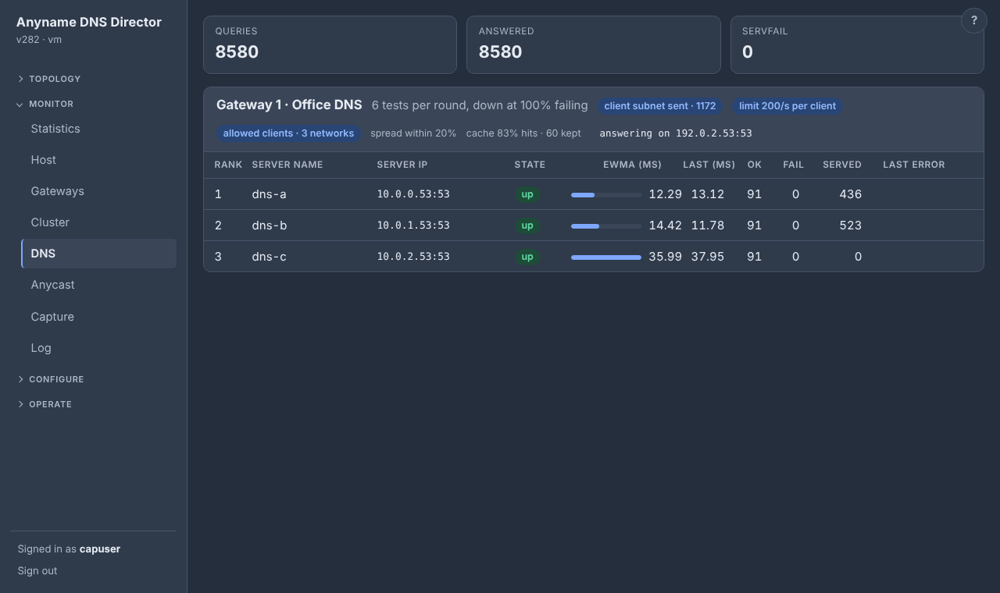

In the GUI, the DNS proxy settings are under Configure ▸ DNS proxy, on six tabs: **Servers**, **Health & balancing**, **Listeners**, **Resolution**, **Cache & ECS** and **Clients**. The help panel (the **?** at the top right) has a page for each tab.

### Choosing an upstream server

- **Eligibility.** Every `dns.queries` entry is resolved against every server each `probe_interval_ms`. A query passes with NOERROR and at least one answer. A server keeps getting traffic until `down_percent` (default 100, which means every query) or more of its queries fail. With fewer failing it stays in use and shows amber (degraded), so one dead domain among three does not take a server out. `50` means one of two, or two of four, failing makes it down; `1` means down on any failure. A server is dropped after `fail_threshold` consecutive failed probe rounds (a client query that fails on it never does this) and is re-admitted by the first passing round.
- **Latency.** Each server has an EWMA of its response time, fed by probe round trips and by live forwarded queries. Eligible servers are tried fastest first. On a timeout, SERVFAIL or REFUSED the next fastest is tried, up to `max_attempts`.
- **Spread.** The healthy servers whose smoothed latency is within `spread_band` percent of the fastest one's (default 20, range 1–1000) take turns, round-robin, so a pool of equally good servers shares its load. Slower servers stay as fallbacks behind them. Spread is on by default; with `"spread": false` (Configure ▸ DNS proxy) every query goes to the fastest server and the rest are kept as fallbacks. The band is relative, so 0.2 ms against 0.3 ms is not "within 20%". The DNS page and `--show-dns` show whether spread is on, and the Served column shows the real split. On the Topology page, the line from a gateway to each server currently within the band is drawn **blue** (`--canvas` marks them `[spread: takes turns]`).
- **No eligible server.** Clients get an immediate SERVFAIL, not a timeout.
- **Truncated answers.** A truncated (TC) UDP answer is relayed so the client retries over TCP, which the proxy forwards over TCP.
- **Loops.** A query is never sent back to the server it came from. Without that, a server of the gateway whose own forwarder points at the gateway (or at an anycast address) would make every such query go round until it timed out, and the server would show as down. The log names such a server once a minute.

**Where the load-balancing settings live.** Spread, spread band, down at, failures before down, max servers tried and latency smoothing are the Settings values for every gateway, including one drawn on the Topology page with its own servers. A gateway can have its own instead: Topology ▸ right-click the gateway ▸ *Edit gateway…* ▸ **Load balancing** ▸ *own values* (`"lb": {…}` in the gateway's `dns` block, or `--canvas-set gateway --group N --spread-band 200`; `--lb settings` goes back).

### Fallback servers

`fallback_servers` in the `dns` block lists upstreams that are used **only while no normal server is in service**: every one down or paused, or none listed. Only a paused or stopped gateway serves nothing at all. Set them in the shared block or in a gateway's own (Configure ▸ DNS proxy ▸ Servers ▸ Fallback servers, *Edit gateway…* on the Topology page, or `--canvas-add fallback --group N --server ADDR` and `--canvas-del fallback …`).

Fallbacks are **never probed** and always count as up, because the domains the normal servers are tested with may be internal names that a public resolver knows nothing about, so probing a fallback with them would only mislead. While no normal server is in service, only the fallbacks take queries. As soon as a normal server passes a probe again, the pool goes back to the normal servers and the fallbacks get nothing.

The DNS page marks the fallbacks and says when they are in use, the canvas shows amber "answering from the fallback servers", and the log says when the pool switches either way. A fallback may use `tls://` or `https://` like any server. It cannot also be a normal server, and `server_queries`, names and pausing apply to normal servers only.

### How clients and servers talk

**Clients to Anyname.** Plain DNS is answered over UDP and TCP on `listen_port` (default 53). Two more listeners are off by default:

- **DNS over TLS.** Set `dot_port` (usually 853) in the `dns` block (shared, or a gateway's own) or under Configure ▸ DNS proxy ▸ Listeners. The VIP, and any anycast address, then also answers DoT (RFC 7858) on that TCP port through the same pool, cache and statistics as plain DNS. The certificate is the web GUI's, whatever Configure ▸ Web GUI shows (the self-signed one until you install a real one), so clients that check certificates need one that is valid for the name or address they connect to. `dot_port` must differ from `listen_port`. If it cannot be opened, the error is logged and plain DNS keeps running. DoT queries count as TCP in the statistics.
- **DNS over HTTPS.** Set `doh_port` (usually 443) and the gateway address, and any anycast address of the gateway, also answers DoH (RFC 8484) at `https://<address>:<port>/dns-query`. Use a POST with an `application/dns-message` body, or a GET with the message as the base64url `dns` parameter. HTTP/2 and HTTP/1.1 work, with TLS 1.2 or later and the GUI's certificate, through the same pool, cache and statistics as plain DNS (counted as TCP). Only that path is served: other paths get 404, a wrong method 405, a wrong content type 415 and a bad message 400. `doh_port` must differ from `listen_port` and `dot_port`. If it cannot be opened, the error is logged and the other listeners keep running. Answers carry `Cache-Control: no-store`, and there is no client-certificate or token check, so it is as open as plain DNS on the same address.

**Anyname to upstream servers.** Whatever the client used to ask, a server can be reached over plain DNS, DoT or DoH:

- **DNS over TLS to a server.** List it as `tls://host` or `tls://host:port` (port 853 by default; the host is an IP address or a name), and Anyname probes it and forwards to it over TLS (RFC 7858). The server's certificate must be valid for that host name or IP address and signed by an authority this machine trusts. A certificate that is not is refused, and the server shows as down with the reason.
- **DNS over HTTPS to a server.** List it as `https://host`, `https://host:port` or `https://host/path` (port 443 and path `/dns-query` unless given), and each query is sent to it as an HTTPS POST of the DNS message (`application/dns-message`, RFC 8484). HTTP/2 is used when the server offers it; redirects are not followed, and no proxy is ever used. The certificate rules are the same as for `tls://`.
- **`tls_insecure`** (Configure ▸ DNS proxy ▸ Servers, in the shared block or a gateway's own `dns` block; off by default) accepts any certificate from a `tls://` or `https://` server: self-signed, expired, the wrong name. Use it only when you cannot fix the server. The traffic is still encrypted, but the server is not authenticated, so anyone on the path could answer as it. While it is on, the DNS page shows "tls:// certificates not checked", `--show-dns` says so, and the log warns when the pool starts. A DoT listener has no client certificate to skip, so this setting is only about the servers you forward to.
- As with DoT, every probe and query to a DoH or DoT server opens a new connection, so its measured latency includes the TLS handshake (and, for DoH, the HTTP request). A plain and a TLS entry for the same host are two servers.

### Client subnet (ECS)

ECS is on by default (`"ecs": true`). Turn it off in Configure ▸ DNS proxy ▸ Cache & ECS ▸ Client network, or per gateway on the Topology page (edit the gateway, then "Tell the DNS servers which network the client is on").

With ECS off, every upstream server sees all queries coming from the Anyname node. With it on, the proxy attaches the client's *network* as an EDNS Client Subnet option (RFC 7871): the first `ecs_prefix4` bits (default 24) of an IPv4 client, or `ecs_prefix6` (default 56) of an IPv6 client, and never the full address. Servers that understand it (Google 8.8.8.8, BIND, Unbound, PowerDNS and others) can then log or answer per client network; the rest ignore it.

The details:

- A client that already sent ECS is passed through untouched.
- A client without EDNS gets the option added, and the OPT record is removed from the answer again.
- A server that answers FORMERR or REFUSED is asked once more without it and, if that works, is not sent ECS any more.
- Loopback and link-local clients are never sent, and probes carry no client.
- `--show-dns` and the DNS page show whether ECS is on and how many queries carried it.

Set it per gateway (inside the group's `dns` block) or in the shared top-level block. ECS does not apply to DoT or DoH to clients.

### The answer cache

A pool answers a repeated query from memory for as long as the records' TTLs allow. The cache is on by default; `"cache": false` or Configure ▸ DNS proxy switches it off, for every gateway, including one with its own `dns` block.

**What is kept.** NOERROR answers (also "no data") and NXDOMAIN. A negative answer is kept only with the zone's SOA, whose MINIMUM says how long it is held (RFC 2308). An entry lives for the smallest TTL among its records and at most `cache_max_ttl` seconds (default 3600). The TTLs a client sees count down with the entry's age and are capped to that maximum. At most `cache_entries` answers (default 10000) are kept, and the least recently used leave first.

**The key.** Name, type and class; the RD, AD and CD flags; EDNS and its DO bit; the UDP size the client allows; the transport; and, with ECS on, the client's network (a /24 or /56), so every network gets the answer the upstream gave it. The ID and the spelling of the name (0x20 randomisation) come from each client's query. A client cookie does not change the key and is dropped from the stored answer.

**What is never cached.** SERVFAIL, REFUSED, truncated answers, zone transfers, TSIG-signed queries, queries with EDNS options other than a cookie (ECS from the client, NSID and so on), and updates. ANY queries are cached like any other type.

**When it is emptied.** Adding, pausing, resuming or removing a server rebuilds the pool but keeps the cache, because the answers do not depend on which server is asked next. Changing the cache's own settings (`cache_entries`, `cache_max_ttl`, the ECS settings), or switching it off and on, starts it empty, which is also how you clear it.

**Warm start.** A node that has just started (after a restart or an update; a node that joins later is warmed at its next start) asks a reachable cluster member for each gateway's most recently used answers, up to 20,000 and about 3 MB, with the age they have there so their TTLs go on counting down (`POST /cluster/cache`, signed like every cluster call). It runs in the background a few seconds after start-up, never delays serving, tries again a few times while the cluster comes up, and then stops. Entries are taken only if the peer's cache settings are the same, never replace or push out an answer this node already has, and nothing is replicated afterwards. A node that nobody answers starts empty.

A cache hit counts as a handled query in Statistics and on the DNS page, which also shows hits, misses and entries (`ddgw --show-dns`: the `answer cache:` line). The cache does not serve stale answers: with every upstream down, a name whose TTL has run out gets SERVFAIL.

### Sort list

`sortlist` in the top-level `dns` block (Configure ▸ DNS proxy ▸ Resolution ▸ Sort List) orders the addresses in an answer for each client network. Every gateway uses it.

It is a list of entries of the form `client-network: preferred-network, preferred-network` (for example `10.1.0.0/16: 10.1.0.0/16, 10.0.0.0/8`), or just a network (`10.20.0.0/16`), which applies to every client; all such entries together give the order, with the one the client is in first. The first entry whose client network contains the asking client is used (`any` matches every client).

The A and AAAA records of a plain answer are put in this order: addresses inside the client network itself first, then those in the first preferred network, then the second, and so on. Addresses in none of them keep their order after those. The sort is stable and per client: the cache is not changed, and an error answer, or one that has record types other than A, AAAA and CNAME, is left as it came. An empty list (the default) keeps the order the servers gave. `sortlist_on` (default true; the **Sort list enabled** tick box) switches it off without deleting the list.

### Policy-Based Resolution

Policy-Based Resolution decides, per query, who answers it: which servers are asked, whether a different name is asked for, or whether Anyname answers by itself. It looks at **who is asking** and **what is asked**.

It lives in the top-level `dns` block (Configure ▸ DNS proxy ▸ Resolution ▸ Policy-Based Resolution), is shared by the cluster, and applies to every gateway. `policy_on` (default true; the **Policy-Based Resolution enabled** tick box) switches it off without deleting the rows. It works for queries that arrive over UDP, TCP, DoT and DoH, and with DoT and DoH servers.

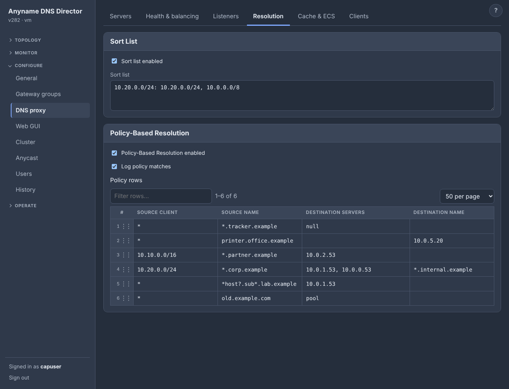

#### The table

Each row has four columns, edited in place like a spreadsheet:

| Source client | Source name | Destination servers | Destination name |
| --- | --- | --- | --- |
| `*` | `*.tracker.example` | `null` | |
| `10.10.0.0/16` | `*.partner.example` | `10.0.2.53` | |
| `10.20.0.0/24` | `*.corp.example` | `10.0.1.53, 10.0.0.53` | `*.internal.example` |
| `*` | `printer.office.example` | | `10.0.5.20` |

In the file, a row is `{"client": "10.10.10.0/24", "name": "*.reddit.com", "servers": ["10.10.10.1", "10.10.10.10"], "dest": "*.hardocp.com"}`.

**The first row that matches wins.** Rows are read from the top, and the first one whose client and name both match decides the query. A query that no row matches goes to the gateway's own servers, as usual.

- **Source client** is `*` (every client), an address (`10.1.1.1`), a network (`10.10.10.0/24`), or several of them separated by commas. A blank client means `*`.
- **Source name** is `*` (every name), an exact name (`reddit.com`), or `*.name` (`*.reddit.com` means `reddit.com` itself and every name below it, at any depth). It can also be a pattern with `*` or `?` inside its labels. A `*` stands for any characters within one label (never a dot) and `?` for exactly one character, so `*host?.sub*.xyzzy.com` matches `myhost1.sub2.xyzzy.com` and `ad-*.example.com` matches `ad-12.example.com` but not `x.ad-12.example.com`. A `*.` at the very front of a pattern still means any labels in front, or none (`*.sub*.xyzzy.com` matches `sub9.xyzzy.com` and `a.b.sub9.xyzzy.com`). A blank name means `*`. Patterns are only for source names.
- **Destination servers** are written like the servers of a pool (`10.2.2.2`, `10.2.2.2:5353`, `tls://dns.example.com`, `https://dns.example.com/dns-query`), separated by commas, and tried in the order given. Instead of servers, the cell can hold one keyword (see below).
- **Destination name** is the name the servers are asked for instead of the one the client asked, or a local answer (see below). Blank, or `*`, asks for the client's own name.

A row with neither servers nor a destination name is not saved; its servers cell is outlined until it has one.

#### Keywords: answering without asking anyone

If the Destination servers cell holds one of these words, the row answers by itself (and takes no destination name):

| Keyword | What the client gets |
| --- | --- |
| `null` | A `0.0.0.0` and AAAA `::`; "no data" for every other type |
| `nxdomain` | The name does not exist |
| `nodata` | The name exists, with no records of that type |
| `refused` | REFUSED |
| `pool` | The gateway's own servers answer, as if no row matched. Put it above a broader row as an exception for one client or one name |

This makes the table a simple blocklist (like a response policy zone) as well as a router.

#### Local answers

To answer with an address of your own, leave the servers blank and write the answer in **Destination name**. Just an address (`10.5.5.5`, or `10.5.5.5, 2001:db8::5`) makes the name those addresses, A or AAAA by kind. For more control, write records:

| Written as | Means |
| --- | --- |
| `A 10.5.5.5, 10.5.5.6` | The name has these IPv4 addresses |
| `AAAA 2001:db8::5` | The name has this IPv6 address |
| `TXT "some text"` | The name has a TXT record |
| `CNAME host.example.com` | The name is another name. Anyname looks the target up for the client and answers with the CNAME and what it found. A CNAME cannot be combined with other records |
| `TTL 300` | Seconds the client may keep the answer (default 60); can appear anywhere in the cell |

Several kinds are separated by `;` (`A 10.5.5.5; AAAA 2001:db8::5; TTL 300`). A query for a type the row has no records of gets "no data", and ANY gets everything. The answer is marked authoritative. A row has either servers or records, not both; the same text in the servers cell also works.

#### Asking for a different name

When the Destination name is a name, the servers are asked for that name instead of the client's, and the answer is turned back so it reads as an answer to the name the client asked.

- A plain name (`zdnet.com`) asks for that name.
- `*.name` (`*.hardocp.com`, only on a row whose source name is a plain `*.name`) keeps the part in front: `www.reddit.com` is asked as `www.hardocp.com`, and `reddit.com` as `hardocp.com`.
- A row with a destination name and no servers (or the word `pool`) asks the gateway's own servers for that name.
- In the answer, the question and every record named like the name that was asked (or below a `*.name` destination) carry the client's name. The other records are as the servers sent them.

**DNSSEC.** This applies only to rows that have a destination name. A row without one passes the servers' answer through untouched, signatures included. With a destination name, a signed answer is not valid for the client's name, and a record of a type that may hold names that cannot be moved safely is answered with SERVFAIL.

#### Things to know

- **Servers of a row are not probed**, so they are never marked down. If none of them answers, the client gets SERVFAIL; the query does not fall back to the gateway's servers.
- **Caching.** Answers are cached for each row's servers and destination separately, so a client sent to one set never gets an answer cached for another.
- **Size and speed.** The table holds up to 10000 rows. Rows are found by name through an index, so a long table does not slow queries down.
- **Log.** `policy_log` (default true; the **Log policy matches** tick box) logs each query a row applied to, at most 100 a second, for example `dns: policy row 3: 10.1.1.1 asked www.example.com A: answered null`.
- **The sort list and the client limits** apply as before.

#### Editing the table in the GUI

The table is shown a page at a time (25 to 500 rows per page), and a **Filter rows** box above it keeps only the rows with that text in any cell. Rows keep their numbers, which are the numbers in the log lines.

Drag a row by the dots at its left to change its order on the page (the first row that matches wins). Right-click a row for **Edit**, **Copy**, **Paste** (the copied row, or rows copied from a spreadsheet as tab-separated text in the column order above, go in below the row), **Add** (a new row below; the filter is cleared), **Move up**, **Move down**, **Move to top**, **Move to bottom** and **Delete**. Right-click below the rows to add one at the end.

### Client rate limiting

These settings are in the top-level `dns` block (Configure ▸ DNS proxy ▸ Clients ▸ Client Rate Limiting). Every gateway uses them, including one with its own `dns` block, whose copy of these values is ignored.

- **`allowed_clients`** is a list of networks (`10.0.0.0/8`, `192.168.1.5`, `2001:db8::/32`) that may use the proxy. Empty (the default) means everyone. Any other client is answered REFUSED, dynamic updates included.
- **`client_rate`** is the queries per second one client (an IPv4 address, or an IPv6 /64) may send; 0, the default, means no limit. **`client_burst`** is how many at once (0 means twice the rate, at least 10).
- **`client_action`** is what a client over its rate gets. `drop` (the default) sends nothing, so a forged source cannot be used to bounce answers at a victim. `truncate` sends a short UDP answer with the TC bit, so a real resolver retries over TCP. `refused` sends REFUSED. Over TCP, DoT and DoH the address is real, and the answer is always REFUSED.
- **`client_exempt`** lists networks that are never rate limited (they stay subject to `allowed_clients`).

The node itself (loopback) is always allowed and never limited. Both checks run before the cache. The DNS page and `--show-dns` show the limit and how many queries were refused or turned away, and the log says so at most once a minute.

Counters are per node, so a client that reaches several nodes gets the limit at each. At most about 130,000 clients are tracked at once, so a flood of new addresses cannot grow memory further; a forgotten client simply starts with a full burst. This is per-client *query* limiting, the kind resolvers use, and not response rate limiting (RRL), which protects authoritative servers.

### Dynamic DNS updates (RFC 2136)

An UPDATE message sent to the VIP (from `nsupdate`, a DHCP server, or Windows and Linux clients registering themselves) cannot be handled by the upstream resolvers. The proxy asks for the SOA record of the zone named in the message, takes the primary server from it (`MNAME`; if that name does not resolve, the zone's NS records), and forwards the message there on port 53, **unchanged**, so its ID and any TSIG or SIG(0) signature stay valid. It then hands the primary's answer back to the client.

- Over TCP the update goes over TCP; a truncated UDP answer is retried over TCP.
- The primary is cached for the SOA TTL (30 seconds to 5 minutes) and looked up again once if the cached one fails.
- No SOA for the zone gives NOTAUTH, an unreachable primary gives SERVFAIL, a malformed message gives FORMERR, and a zone class other than IN gives NOTIMP.
- An update is never forwarded to the VIP itself.
- A primary that filters by source address sees the Anyname node, not the client. Use TSIG keys, which travel with the message.

Every update is logged (INFO when the primary accepted it, WARN otherwise) and counted in Statistics as the type **UPDATE** under the zone name, with its own **Updates** tile (the count and how many failed) and a chart line. Updates are counted in the total but not again under No Error or Refused. Click the **Updates** tile to see only updates (chart, who sent them, which zones), and the last 200 under **Recent dynamic updates** (also `ddgw --dns-updates`): time, client, zone, what it changed (`add host1.example.com A 192.0.2.7`, `delete old.example.com A`), the primary and its answer.

Switch it off with `"forward_updates": false` (Configure ▸ DNS proxy ▸ Listeners); updates are then answered REFUSED. Note that anyone who can reach the VIP can send updates to your primary this way, so the primary's own authorisation (TSIG, ACL) is what decides.

### Per-server probe domains and reloading

Probe domains can be set per server (`server_queries`), and a gateway can have its own pool; see [Topology](#topology). The whole `dns` block hot-reloads, and a changed pool is probed before it replaces the old one.

## Topology

The first page of the GUI is a drawing of your configuration. Each **gateway is an item under Topology** in the sidebar (right-click it ▸ **Rename…** or **Delete**), with *＋ New gateway…* at the end.

The drawing has three kinds of shape:

- a **circle** for the gateway (its shared address, the VIP),
- a **square** under it for every DNS server it forwards to, and
- a **trapezoid** under each square for every domain that server has to answer.

**The drawing is the gateway, not the selected node.** When the node picked in the Node menu does not serve the gateway (another subnet, removed from it, or paused there), it has no servers probed of its own. The circle, servers, domains and anycast addresses are then those of a node that does serve it, asked over the cluster channel, and the circle's tooltip says which ("As NODE sees it"). The node shapes still say what each node, this one included, is doing. If no node serves the gateway, or the one asked does not answer within a few seconds, you see the selected node's own view. `ddgw --canvas` is always the node's own view.

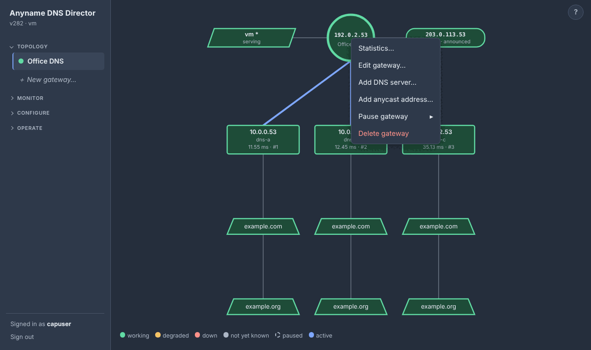

### What the colours mean

The colours come from the running daemon.

- **Green** is working.
- **Yellow** is degraded: the gateway runs but a server is down, or a server is up but one of its tests fails.
- **Red** is down: no healthy server, or a server that fails its tests.
- **Grey** is not known yet (not applied, or not probed yet).
- **Dashed grey** is paused.

A gateway's dot in the sidebar is the state of the gateway for the **cluster as a whole**, built from its nodes and the same whichever node the Node menu has selected. It is green while any node serves it, amber while it is only served degraded, dashed grey when every node has it paused, and red when no node serves it. A node on another subnet that does not run the gateway does not count against it.

The circle shows just the address (no prefix length) and sizes itself to fit even a full IPv6 address. A dual-stack gateway shows both, with a small green, yellow or red chip for each family, and the gateway's own colour is the worst of the two (an IPv6 engine that is not serving is yellow even if IPv4 is fine). Hover the circle to see which cluster nodes are serving the gateway right now: which is this node, which is the controller, and each node's slot.

A **domain** is a health test, not a route. Anyname sends every client query to the fastest healthy server; a server counts as healthy while fewer than `down_percent` (100%, every one) of *its* domains fail.

Every tooltip ends with the item's **uptime**: how long the gateway, anycast address, server or domain has been online since it last came back, or how long it has been down, and how many failures it has had ("Online for 1m 1s - 0 failures"). Green and yellow count as online; paused and grey items show nothing. A sampler in the daemon notes the changes every 2 seconds (no browser needed), in memory only, so the counting, failures included, restarts with ddgw. `ddgw --canvas` prints the same in brackets.

### The cluster nodes

Each node of the cluster (or just this node, when it is alone) is a **parallelogram** to the left of the circle, this node first and marked with a star. It is named by host name (by address when two nodes share a name), with how it stands for this gateway:

- green *serving*,
- amber *not serving* (up, but not serving the gateway yet),
- amber *degraded* (serving, but its own view of the gateway is degraded, for example because some of its DNS servers are down),
- dashed *paused* (the node is paused on the Operate page, or the gateway is paused or absent there), and
- red dashed *not answering*.

A node whose **CPU, memory or fullest disk is over 85%** is **solid yellow** (degraded), whatever else it is doing, even paused. It names what is over ("CPU 91% · disk 88%"; the tooltip names the mount) until every one is back at 85% or below. The figures are the Monitor ▸ Host numbers: the last 10-second CPU sample, memory in use, and the fullest of the tracked filesystems. The log records it too: a warning when a node goes over (naming CPU, memory and/or disk) and an info line when it is back at or under, for this node and every reachable member, checked each sync interval. A reading that only moves while still over is not logged again.

Hover a node for its address, role, last-seen time, version, whether it has caught up with the primary's settings, and any update under way. Right-click a reachable node for:

- *Pause node…* or *Resume node* (another node is paused through the cluster, like the Node page does with the Node menu; its shape reads "pausing…" until it reports back),
- *Remove from this gateway…* (see below),
- *Host statistics…*, and, for another node, *Open this node* (the same as the Node menu, top right).

For an unreachable node the menu offers *Cluster page…*. Nodes are read-only here; add or remove them on the Cluster page. `ddgw --canvas` lists them as `/_/ cluster node` lines.

### Which nodes serve a gateway

Every node that is in the cluster serves every gateway unless it is removed from it. To change that, right-click a node ▸ *Remove from this gateway…*, or right-click the gateway ▸ *Add node* ▸ the node. On the command line, use `--canvas-del node --group N --node NODE` and `--canvas-add node --group N --node NODE`, where NODE is the node's address or host name.

The removal is **shared** (`excluded_nodes` in the gateway's block, a list of node IDs, absent while empty so older versions still read the file). Any node can change it, every node follows, and it survives restarts. A removed node behaves as if the gateway were paused on it: it resigns, gives up the address, and stops answering and probing for that gateway only. Its shape is no longer drawn on that gateway on any node (`ddgw --canvas` still lists it, as *removed*), and the gateway's circle on that node says it was removed. *Add node* on the gateway lists the removed nodes by name.

A node that **joins** the cluster later is left out of every gateway when it joins (the primary adds it to each gateway's `excluded_nodes` before the joiner's first sync), so joining changes nothing about who answers. Put it where it should serve with right-click the gateway ▸ *Add node*. Gateways created afterwards are served by every node. The last node serving a gateway cannot be removed; pause the gateway on all nodes instead. This is not the same as *Pause ▸ This node*, which is kept on that node alone, for maintenance.

### Layout of the drawing

The anycast addresses (right of the circle) and the cluster nodes (left) stand four to a column, and the fifth starts a new column further out, and so on. When a four-row side would have a line to a server run through a box, both sides use three rows instead. Anycast addresses can be dragged to any slot, in any column. The drawing grows wider as columns are added (pan with the mouse).

**Zoom, pan and arrange.** Dragging the empty background moves around the drawing in any direction. The mouse wheel over the drawing zooms it (20% to 300%, around the pointer); the zoom is kept across refreshes and reset when you pick another gateway, and a double-click on the empty drawing fits it to the window again. **Drag** a server left or right (it takes its domains along), a domain up or down, or an anycast address up or down to put it in another place. A dashed outline shows where it will land, letting go saves the new order, Escape puts it back, and a click without moving still just selects. The order is only how things are drawn and probed (servers are still chosen by speed). CLI: `ddgw --canvas-move server|domain|anycast … --to N`.

### Editing the drawing

**Right-click** anything. The circle offers *Edit gateway…*, *Add DNS server…*, *Add anycast address…*, *Add node*, *Pause*, *Statistics…* and *Delete gateway*. A square offers *Statistics…*, *Edit server…*, *Add domain…*, *Pause* and *Delete server*. A trapezoid offers *Edit domain…*, *Add domain…*, *Pause* and *Delete domain*. The empty drawing offers *New gateway…* and *Add DNS server…*. Add and Edit open a popup form; deleting something with things under it asks first and says how many. Left-click selects a shape, and the Delete key deletes it. There is no button row; the right-click menu is the one place for these actions.

**Add DNS server** looks things up for you. Fill in the IP address and the **Name** is filled in from its reverse (PTR) record; fill in a host name as the Name and the address is looked up (IPv4 preferred). The lookup is made once by the node being configured, when you leave the field, and only fills a field that is empty or still holds an earlier lookup. A name or address you typed yourself is never overwritten, and you can change a looked-up name to anything (it is saved as typed). CLI: `ddgw --dns-lookup IP|NAME`. A domain name too long for its trapezoid is cut with "…" so it stays well inside the shape, and so is a long server address or name inside its box (hover for the full text).

**Deleting.** Deleting a trapezoid removes just that test, deleting a square removes the server and all its domains, and deleting a circle removes the gateway and everything under it (you are asked first, with counts). Deleting the last circle leaves a configuration with no gateways: `"groups": []`.

**Every change is saved as soon as you make it**; there is no Apply button, and every change is a config version (see [Config history](#config-history)). To keep every saved state valid, a new gateway starts without a DNS proxy (it gets one with its first server), adding a server asks for its first domain, the last domain of a server cannot be deleted (delete the server instead), and deleting the last server leaves a bare gateway. If the daemon refuses a change, the drawing goes back to what is saved and the reason is shown.

### Pause and resume

Right-click a gateway, server, domain or anycast address ▸ *Pause ▸ This node* or *All nodes* (and *Resume* the same way). *This node* is kept in this node's own settings and never replicated; *All nodes* is shared. The two scopes are independent, so an item paused on both stays paused until both are resumed. Paused items are grey and dashed, and the tooltip says where.

- A paused **gateway** releases its address and stops answering.
- A paused **server** gets no queries or probes.
- A paused **domain** is not asked.
- A paused **anycast address** is not announced (the gateway keeps serving).

When all but one of a server's domains are paused, the server turns amber, because a single domain is all that is checked. When every domain is paused, it turns red and counts as down; it gets no queries until one is resumed.

CLI: `--canvas-pause|--canvas-resume gateway|server|domain|anycast --group 1 [--server ADDR] [--name DOMAIN] [--address ADDR] --scope node|all`. `--scope` defaults to node for a gateway and all for a server, and is required for a domain or an anycast address. To take the **whole node** out at once (every gateway on it, including ones added later), use Operate ▸ Node ▸ *Maintenance* (or `--node-pause`); see [Operating a node](#operating-a-node).

**Resuming** (and starting the daemon, or adding a gateway) does not put the node back in service at once. It first probes its DNS servers and only joins the gateway when they all answer, or, after 10 seconds, when at least one does (after 60 seconds it starts regardless). Meanwhile the other nodes keep serving and the circle shows "starting — waiting for the DNS servers to answer".

### Statistics from the drawing

Right-click a square, a trapezoid or the circle ▸ *Statistics…* for graphs over the last hour, day or week (per minute for the hour, per 5 minutes for a day, per 30 minutes for a week). CLI: `ddgw --server-stats ADDR [--stats-range 1h|1d|7d]`, `ddgw --server-stats ADDR --name DOMAIN [--type T]`, `ddgw --gateway-stats GROUP`.

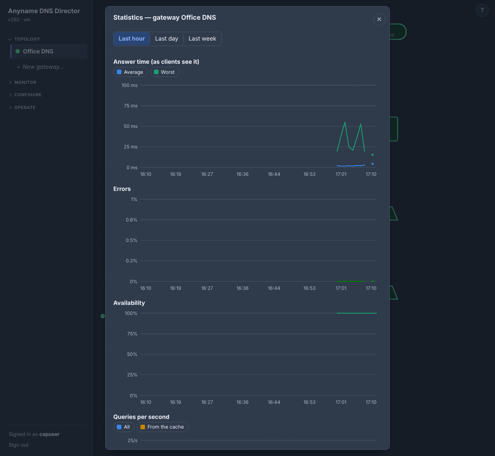

- A **server** (square) shows **latency** (the average and worst of the answers), **failed probes** (the share of the server's own test queries that failed, which is what decides whether it is up) and **failed queries** (the share of client queries sent to it that failed: no answer in time, or SERVFAIL or REFUSED; a healthy server can show these for names it cannot resolve).
- A **domain** (trapezoid) shows the latency and the failed share of the health probes of that domain on that server. These are probes only, about 12 a minute, so the failure curve is coarser.
- The **gateway** (circle) shows what clients get: **answer time** (one answer in eight is timed, cache hits included), **errors** (SERVFAIL and REFUSED answers, not clients turned away by the client list or rate limit), **availability** (the share of the 2-second checks, the same ones that drive the circle's uptime, that found the gateway working; paused or not-yet-started time is not counted) and **queries per second**, with the part answered from the cache.

A server's and a domain's graphs are the picked node's own view. A gateway's graphs add up every reachable node of the cluster, since which node answers a client is up to the clients; the dialog says "All 3 nodes counted together", or how many were counted and how many did not answer (a single node shows just this node). A gap means nothing happened in that time: paused, the node was down, or, for a server or domain, nothing was asked of it. The history is kept per node for 7 days, one slot per minute, and saved with the other statistics (`stats.json.gz`, every 5 minutes and when Anyname stops), so a restart keeps it; the time Anyname was down is a gap. A server address listed by two gateways is one series, and a gateway's series covers all its addresses (IPv4, IPv6, anycast) on this node.

### Pools, families and the cluster

- Each gateway has its **own pool**, and two gateways may use different servers. A server can be an IP (`8.8.8.8`, `8.8.8.8:5353`, `[2001:db8::53]`) or a host name (resolved each time it is probed).
- A gateway may have an IPv4 and an IPv6 address (one engine per family). DNS servers can be IPv4, IPv6 (`2001:db8::53`, `[2001:db8::53]:5353`) or names.
- A gateway may hold **more than one address per family**, all in the subnet of its VIP: Edit gateway ▸ *More IPv4 addresses* / *More IPv6 addresses* (comma separated, no prefix length; `more_vip4` and `more_vip6` in the file, up to 32 each). They fail over with the VIP, are answered in ARP / neighbor discovery the same way, and answer DNS, DoT and DoH through the same pool, cache and statistics. The VIP stays the one the nodes find each other by. An address of another subnet is an anycast address instead.
- In a cluster the whole drawing (address, servers, domains) is shared and edited anywhere. The network interface stays per node.
- Two gateways cannot use the same shared address. An anycast address may be on several gateways (see [Anycast addresses and BGP](#anycast-addresses-and-bgp)); it is held while any of them can answer.

### The same thing on the command line

`ddgw --canvas` prints the same tree and the same colours, and the other commands change it:

```
ddgw --canvas                                  # tree with status
ddgw --canvas-add gateway --vip 10.0.0.53/24 --interface eth0 \
     --server 8.8.8.8 --name google.com        # circle + first square + first trapezoid
ddgw --canvas-add domain --group 1 --server 8.8.8.8 --name microsoft.com
ddgw --canvas-add server --group 1 --server 8.8.4.4 --name apple.com
ddgw --canvas-del domain --group 1 --server 8.8.4.4 --name apple.com
ddgw --canvas-add fallback --group 1 --server 1.1.1.1   # used only while every server is down
ddgw --canvas-set gateway --group 1 --vip6 2001:db8::53/64 --ecs on   # add IPv6, turn on ECS
ddgw --test-vmac --group 1                                  # do virtual MACs reach this node? (changes nothing)
ddgw --canvas-set gateway --group 1 --real-macs on          # no virtual MACs, on every node (off undoes it)
ddgw --canvas-set gateway --group 1 --label "Office DNS"   # a name instead of the address (--label - clears)
ddgw --canvas-set gateway --group 1 --spread-band 200      # this gateway's own load balancing (also --spread on|off, --down-percent,
                                                           #   --fail-threshold, --max-attempts, --latency-alpha); --lb settings goes back
ddgw --canvas-set server --group 1 --server 10.0.0.53 --label dns-a   # a server's name (also on --canvas-add server; - clears)
ddgw --canvas-add anycast --group 1 --address 203.0.113.53   # an anycast address (--canvas-del anycast removes one)
ddgw --canvas-set gateway --group 1 --anycast A,B             # or replace the whole list (--anycast - clears)
ddgw --canvas-del gateway --group 1 --yes
```

Each CLI step is saved at once, so a new server is added together with its first domain. In the file it is a `dns` block inside the group:

```
"dns": { "servers": ["8.8.8.8", "8.8.4.4"],
         "server_queries": { "8.8.8.8": ["google.com", "microsoft.com"],
                             "8.8.4.4": ["apple.com", "amazon.com"] } }
```

Groups without their own `dns` block use the top-level one, and `server_queries` entries override the global `queries` for that server.

## Anycast addresses and BGP

### Anycast addresses

A gateway can carry extra addresses of **any subnet** next to its shared address (`extra_vips`). In the GUI, right-click the gateway circle ▸ *Add anycast address…*; each address becomes a pill beside the circle with its own menu. On the command line, use `--canvas-add anycast --group 1 --address 203.0.113.53`, `--canvas-del anycast …`, or `--canvas-set gateway --group 1 --anycast A,B` to replace the whole list.

Anycast addresses are not checked against the interface and do not take part in the election. **Every** node running the gateway puts them on `lo` and answers DNS on them, with the same servers, domains and failover as the shared address, on `listen_port`. They are shared across the cluster and need DNS servers on the gateway.

An address is held only while this node can answer on it: the gateway is running and not paused, the listener is up, and at least one DNS server is healthy. Otherwise it is taken off `lo`, so the route disappears from your routing daemon. It is added with a 10-second lifetime that Anyname renews every 3 seconds, so if Anyname crashes or hangs, the kernel removes the address by itself within about 10 seconds instead of leaving a route that nothing answers.

The drawing and `--canvas` show whether each address is announced from the node you are looking at. When the node manages BGP, the pill is **green** when every neighbor of its family has an established session (IPv4 address → IPv4 neighbors, IPv6 → IPv6), **amber** when some do and some do not, and **red** when none does, when it has no neighbor of that family, or when BGP is disabled on the node (Operate ▸ Anycast). A neighbor that is disabled or still connecting counts as not established.

### BGP through FRR

Anyname can drive FRR on a node so the anycast addresses are announced without any hand-written routing config. In the GUI that is **Configure ▸ Anycast**; the command line is below. It is **per node**: the AS, router ID and neighbors are never replicated, because a node usually peers with its own upstream router. Only the anycast addresses are shared.

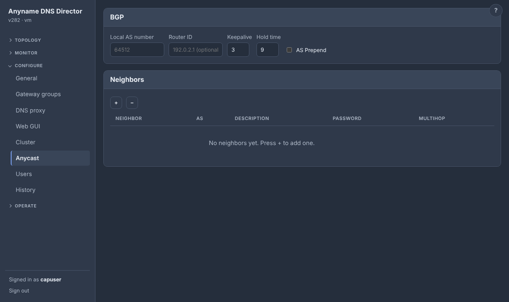

**Turning BGP on.** BGP runs on a node while a local AS number is set. That makes Anyname the owner of the node's `/etc/frr/frr.conf`: it renders the whole file (BGP only), sets `bgpd=yes` and `bfdd=yes` in `/etc/frr/daemons`, and reloads FRR (`systemctl reload frr`; a restart when a daemon is switched on or off). FRR must be installed with its `frr-pythontools` package (the installer adds both). Without it a reload cannot work, so Anyname restarts FRR for every change and the sessions drop briefly. An `frr.conf` that Anyname did not write is saved once as `frr.conf.pre-ddgw` before it is replaced. Do not run this on a host whose FRR is managed by something else; they would overwrite each other.

**Turning it off.** Clearing the AS number removes the BGP section and leaves FRR running (the router ID can only be set while an AS is set, and clearing the AS clears it). **Operate ▸ Anycast** does the same without forgetting any setting (*Disable BGP*), and can shut down a single neighbor (`neighbor … shutdown`; the neighbor stays configured). A node that never set an AS never has its FRR files touched.

**Settings.**

- BFD is on for every neighbor.
- BGP keepalive and hold time are settings next to the router ID (default 3 s and 9 s; `--keepalive S --hold S`, `-` for the default). The session uses the lower hold time of the two ends.
- **AS prepend** (Configure ▸ Anycast, a tick box; `--as-prepend on|off`; `as_prepend` in the `bgp` block) adds the local AS three more times to every anycast route the node announces (`set as-path prepend ASN ASN ASN` in the outbound route-maps), so routers prefer the nodes that do not have it. Tick it on the nodes that should be the backup.
- A neighbor can have a **multihop** limit (2–255, eBGP only) for a peer that is not on a connected subnet. FRR then runs BFD to it in multihop mode, so the peer must be set up the same way.

```
ddgw --bgp                                                    # settings, neighbor and BFD state, announced addresses
ddgw --asn 64512 --router-id 192.0.2.10        # --router-id needs an AS, set now or earlier
ddgw --keepalive 3 --hold 9
ddgw --as-prepend on                  # the local AS three more times on every announcement (off undoes it)
ddgw --bgp-neighbor-add 192.0.2.1 --remote-as 64500 --description core
ddgw --bgp-neighbor-add 2001:db8::1 --remote-as 64500
ddgw --bgp-neighbor-add 10.0.1.5 --remote-as 64512 --multihop 2   # peer not on a connected subnet (e.g. AWS VPC Route Server)
ddgw --bgp-neighbor-del 192.0.2.1
ddgw --asn off                                 # also clears the router id
ddgw --bgp-disable                             # stop BGP on this node, settings kept (--bgp-enable)
ddgw --bgp-neighbor-disable 192.0.2.1          # shut one neighbor down, kept (--bgp-neighbor-enable)
```

**What the node does, and no more.**

- **It announces only its anycast addresses.** Each is a `network` statement, and an outbound route-map permits only those prefixes (`/32` and `/128`).
- **It accepts nothing.** An inbound route-map denies every route, so a peer cannot change the host's routing table.
- **An IPv4 address goes to the IPv4 neighbors, and an IPv6 address to the IPv6 ones.** Add a neighbor of each family to announce both.
- **A prefix is in FRR's table only while Anyname holds the address on `lo`**, so it is withdrawn when no DNS server answers, the gateway is paused or Anyname stops, and within about 10 seconds if Anyname is killed (the address lifetime, above). Lower the router's timers to shorten the time your peers need to notice.
- **The neighbor password** is an MD5 TCP session password. It is stored in the config file and its history (root-only), and `--password` on the command line is visible to other users of the host, so the Anycast page is the safer place to set it.

**Where to look.** **Monitor ▸ Anycast** shows each neighbor's session and BFD state, read from FRR every few seconds (`vtysh -c "show bgp summary json"`, `show bfd peers json`), and which anycast addresses are announced. **Configure ▸ Anycast** (card *BGP*) has the AS, router ID and the neighbor table (**+** adds a row, **−** removes the highlighted one).

The generated config looks like this:

```
ip prefix-list DDGW-ANYCAST-V4 seq 10 permit 203.0.113.53/32
route-map DDGW-OUT-V4 permit 10
 match ip address prefix-list DDGW-ANYCAST-V4
route-map DDGW-IN deny 10
router bgp 64512
 no bgp default ipv4-unicast
 neighbor 192.0.2.1 remote-as 64500
 address-family ipv4 unicast
  network 203.0.113.53/32
  neighbor 192.0.2.1 activate
  neighbor 192.0.2.1 route-map DDGW-IN in
  neighbor 192.0.2.1 route-map DDGW-OUT-V4 out
 exit-address-family
```

### Cloud use (untested)

Clouds block multicast and ignore virtual MACs, so the gateway VIP cannot be reached there (real-MAC mode lessens the second problem, not the first). The anycast addresses can: they are plain `/32` routes announced over BGP. A possible setup follows, **not tried in any cloud**:

1. Give a gateway a VIP that is an **unused address in the node's own subnet** (a gateway only starts when the node has an address in the VIP's subnet), and list **every node's address** under *Neighbors (unicast mode)* so the nodes find each other without multicast. The list is shared, so you fill it in once. The VIP forms but nobody uses it.
2. Add the anycast addresses to that gateway and announce them with BGP (Configure ▸ Anycast). For a peer that is not on a connected subnet, such as an AWS VPC Route Server endpoint, set the neighbor's **Multihop** (usually 2); the peer must use multihop BFD as well.
3. The gateway joins the election only after its DNS servers answer, and an anycast address is announced only while a server answers.
4. In AWS, also turn off source/dest check on the instances, and allow BGP (TCP 179) and BFD (UDP 3784 and 4784) in the security groups.

## Gateway roles, virtual MACs and real-MAC mode

This section is the detail behind [How it works](#how-it-works), for when you need to know exactly what the nodes do on the wire.

### The VIP on controllers and forwarders

The AGC owns the VIP on its macvlan. An AFN is reached through its vMAC, but the kernel only accepts traffic for addresses it owns. So an AFN adds the VIP to `lo` as a /32 (/128) and sets `arp_ignore=1` and `arp_announce=2` on the parent interface and its macvlan, so it never answers or advertises ARP for the VIP. The AGC stays the only ARP and neighbour-solicitation authority.

### Who is controller

The node that is controller stays controller. A node that joins or restarts becomes a forwarder even when its priority is higher or its address sorts higher. It takes the role only if it has **preemption** enabled (the Settings switch) and outranks the controller, or if two controllers meet and one must give way. So after a node is restarted, the roles stay as they fell, instead of moving twice.

The controller marks its hellos with a flag (bit 3). A node that took over keeps its old slot number, so slot 1 alone no longer tells a joiner who the controller is. A leaving node sets bit 2.

### Slots and virtual MACs

A slot is one MAC (`00:1a:7c:<group>:<slot>:00`) on the wire, whichever address family uses it. A node takes the same slot in IPv4 and IPv6 when it can, and never one that a node it hears (in either family) already has.

A controller that gives way to a better one moves to a free forwarder slot. Two forwarders that picked the same slot settle it by rank (the lower one moves). The IPv4 and IPv6 sides of a node share the interface of a slot, which is removed only when neither uses it any more. The two families elect their controllers separately and may pick different nodes; the IPv6 controller then moves off slot 1 to a free slot, so no MAC is ever on two nodes.

### Real-MAC mode (no virtual MACs)

Virtual MACs need the network to deliver frames addressed to a MAC that is not the NIC's own. A VMware port group with promiscuous mode off drops them, and so do clouds that allow one MAC per interface. For those networks, a gateway has a setting, **Use real MAC addresses** (Configure ▸ Gateway groups; `real_macs` in the file; `--configure`). It is shared by the cluster, and changing it restarts the gateway.

It is **on for a gateway you create** (first start, Add gateway, `--canvas-add gateway`, `--configure`), because most networks need it. A gateway that already existed keeps the setting it had (a file that does not say `real_macs` means off), so an upgrade changes nothing. Off is the older way: a virtual MAC per node, which fails over without depending on the neighbors (see the last point below).

In real-MAC mode, everything above is replaced as follows:

- **No macvlan, no slot MAC.** Every node, the controller too, holds the VIP on `lo` and has `arp_ignore=1` and `arp_announce=2` set on the real interface (put back when the gateway stops).
- **The controller still answers** ARP and IPv6 neighbor solicitations for the VIP, and still picks a node by the load-balancing method. The answer names the **real MAC** of the node it picked: its own MAC for its own slot, and also for any node whose MAC it does not know yet (it holds the VIP too, so that is always right). It is sent from the controller's own MAC.
- **The controller learns the real MACs** without any change to the gateway protocol: from an ARP a node sends, from any IPv6 frame from a node's link-local address, and by asking (an ARP request or a neighbor solicitation of its own) for the ones it has not heard, again every minute. Nodes of any version take part.
- **A real MAC cannot be taken over.** When a node dies or leaves, the controller announces the VIP at its own MAC with an unsolicited ARP (or neighbor advertisement), now and twice more within a second. Neighbors that honor one repoint at once; the others keep sending to the dead node until their ARP entry ages out (a Palo Alto's default is 30 minutes). Check how your firewalls treat it, and turn the setting off for a gateway whose neighbors do not honor one. A planned stop gives the announcement a head start, because the leaving node stays up for a moment after the controller has been told.
- **The vMAC column** of Monitor ▸ Gateways shows real MAC addresses (the controller knows all of them; a forwarder only its own).

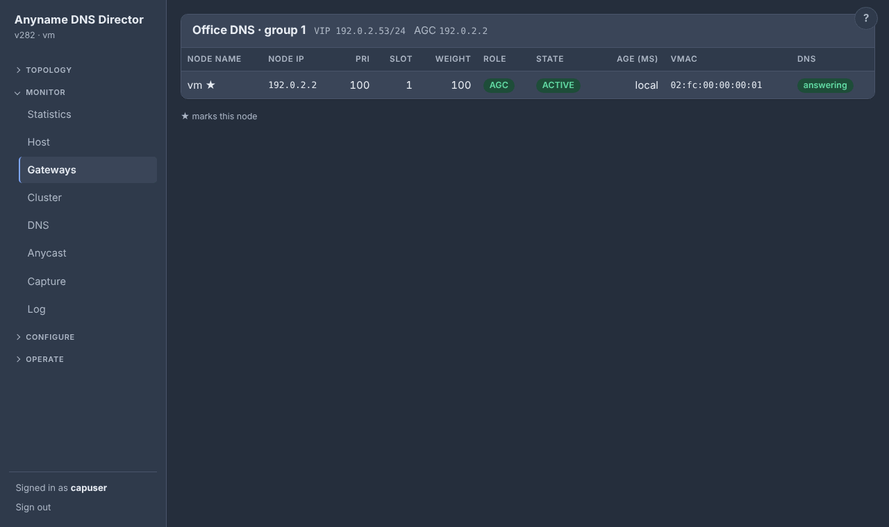

## The web GUI

Everything the command line does is also in a browser, over HTTPS on port **53853** (`web.listen`). The page follows the system light or dark theme automatically. The **?** at the top right of every page opens a slide-out help panel for that page, with its command-line equivalents and a description of every field on it.

Saving applies immediately, with the same hot reload as editing the file.


### Signing in

**Login** is backed by PAM: a user may log in if PAM accepts their password *and* they are a member of the `ddgw` group.

```
groupadd ddgw
usermod -aG ddgw alice
cp contrib/pam.d/ddgw.debian /etc/pam.d/ddgw     # or ddgw.rhel
```

Without `/etc/pam.d/ddgw`, PAM falls back to its `other` policy, which usually denies everything. `root` is not special: add it to the group if you want it to log in. Removing a user from the group ends their session within a minute.

The PAM binding uses cgo, so build natively with `libpam0g-dev` (Debian and Ubuntu) or `pam-devel` (RHEL) installed. A build without cgo, including any cross-compile, has no PAM, so it **refuses to start the GUI** rather than serve it unauthenticated. The daemon and the command line work normally.

### Which page does what

| CLI | Web GUI |
| --- | --- |
| `--canvas`, `--canvas-add`, `--canvas-del` | Topology page (draw gateways, servers, domains; live colours) |
| `--canvas-add node` / `--canvas-del node` `--group N` `--node NODE` | Topology page: right-click the gateway ▸ **Add node** / right-click a node ▸ **Remove from this gateway…** |
| `--server-stats ADDR` `[--stats-range 1h\|1d\|7d]` | Topology page: right-click a server ▸ **Statistics…** (latency and loss graphs) |
| `--canvas-move server\|domain\|anycast` `--group N` `--server ADDR` `[--name DOMAIN \| --address ADDR]` `--to N` | Topology page: drag a server left/right, a domain or an anycast address up/down |
| `--dns-lookup IP\|NAME` | Add DNS server form: the Name is filled in from the address (reverse DNS), or the address from a name |
| `--server-stats ADDR --name DOMAIN` `[--type T]` | Topology page: right-click a domain ▸ **Statistics…** |
| `--gateway-stats GROUP` `[--stats-range 1h\|1d\|7d]` | Topology page: right-click the gateway circle ▸ **Statistics…** (answer time, errors, availability, queries) |
| `--show-gateways`, `--show-neighbors` | Gateways page (roles, slots, vMACs, DNS listener state) |
| `--assert-agc` | Operate ▸ Node ▸ **Gateway controller**: "Make this node the gateway controller" (asks to confirm) |
| `--cluster-status` | Monitor ▸ Cluster (the members) |
| `--show-dns` | DNS tab (ranking, health, latency bars, counters) |
| `--show-config`, `--configure` | Configure pages (form; every edit saves and applies at once) |
| `--versions`, `--version-show/-diff/-snapshot/-restore/-export`, `--config-import` | History tab |
| `--users`, `--user-add`, `--user-grant`, `--user-revoke`, `--user-passwd`, `--user-expiry`, `--user-del` | Configure ▸ Users |
| `--tls-status/-install/-csr/-revert/-regenerate` | Configure ▸ Web GUI (certificate) |
| `--cluster-status/-token/-join/-promote/-remove/-unremove/-leave/-sync` | Cluster tab |
| `--update-status/-history/-upload/-apply/-push` | Upgrade tab (stats at the top, upload, a paged History of every update event (`--update-history` prints them all; `--update-status` the newest 50), Nodes card: tick members, **Update this node now** / **Update N selected**) |
| `--update-auto` | Configure ▸ General ▸ **Upgrade** card |
| `--update-cancel` | command line only (the Upgrade tab shows what is queued) |
| `--stats-clear` `[--all-nodes]`, `--scan ADDR` | Statistics page: **Clear**; right-click a client ▸ **Scan** (prints the report) |
| `--stats` `[--stats-range 1h\|1d\|7d\|30d] [--stats-rcode KIND] [--stats-client ADDR \| --stats-domain NAME] [--all-nodes]`, `--whois NAME`, `--dns-updates` | Statistics page (Monitor); the last is its **Recent dynamic updates** card |
| `--host` `[--host-range 1h\|1d\|7d\|30d] [--all-nodes]` | Host page (Monitor); `--all-nodes` is the Node menu's **Cluster** entry (also on Statistics) |
| `--capture IFACE` `[--capture-seconds N] [--capture-filter EXPR] [--capture-file FILE] [--all-nodes]`, `--capture-interfaces` | Capture page (Monitor); `--all-nodes` is the Node menu's **Cluster** entry there |
| `--tshoot` `[--all-nodes] [--tshoot-file F]` | Log page ▸ tshoot |
| `--log` `[--log-min LEVEL] [--log-grep WORDS] [--log-since 6h] [--log-lines N]` | Log page (Monitor) |
| `--power restart\|shutdown\|cancel\|status` `[--in MIN \| --at HH:MM]` | Operate ▸ Node ▸ **Host** |
| `--node-pause`, `--node-resume`, `--node-status` | Operate ▸ Node ▸ **Maintenance** (Pause / Resume this node) |
| `--bgp-disable`, `--bgp-enable`, `--bgp-neighbor-disable ADDR`, `--bgp-neighbor-enable ADDR` | Operate ▸ Anycast (Disable / Enable BGP, and per neighbor) |
| `--version`, `--help` | version in the header; the **?** at the top right of every page opens a slide-out help panel for that page (including its command-line equivalents and a description of every field on the page) |

### TLS and security notes

**TLS.** With no certificate configured, a self-signed one is generated next to the config file (`ddgw-web.crt` and `.key`, key mode 0600) and renewed at start-up when it is within 30 days of expiry. Your browser will warn until you install a real certificate; see [The GUI certificate](#the-gui-certificate).

**Exposure.** The GUI can reconfigure a daemon that runs as root and listens on all interfaces by default. Bind it to a management address (`"listen": "10.0.0.5:53853"`) or firewall the port.

**Sessions and cookies.** Sessions are kept in memory and saved to `sessions.json` in the state directory (mode 0600, only a SHA-256 of each cookie), so an upgrade or a restart of the daemon does not sign anyone out; the idle timeout and the 12 hour limit still apply. Changing the GUI listen address does sign everyone out. A user's sessions also end when that user's password changes, the account is deleted or it expires. Cookies are HttpOnly, Secure and SameSite=Strict, named with the `__Host-` prefix. Every change carries a CSRF token, and a strict CSP (no inline script) is in force.

**Failed logins** are limited. By default, 3 wrong passwords within 1 minute lock that address, and that address together with that user name (never the user name alone), out for 15 minutes. All three numbers are on Configure ▸ Web GUI (`web.max_failed_logins`, `web.failed_login_window_minutes`, `web.lockout_minutes`). A failed login gets one message that does not say what was wrong, which group is needed, or how many tries are left, because that would give a guesser a target. Only once an address is locked out does the login page say "Too many failed attempts." and disable its form until the lockout ends.

**Passwords** set on the Users page must have at least 8 characters (`web.min_password_length`, 1–128; absent or 0 means 8).

**Management commands** (everything under `--versions`, `--tls-*`, `--cluster-*`, `--update-*`, and `--assert-agc`) go over the local status socket, which only root may use (file mode plus `SO_PEERCRED`).

## Users

Configure ▸ Users (or `ddgw --users`) manages the accounts that may sign in to the GUI: the members of the GUI group (`ddgw`, or `web.group`). They are ordinary operating-system accounts on the node, managed with `useradd`, `usermod`, `userdel` and `chpasswd`, so PAM stays the single place passwords are checked. A new account has no shell and no home directory and exists only to sign in. Each account can have an expiry date, and the operating system refuses it from that day.

The accounts are listed on the left. Pick one to change it on the right: type a new password and/or change the expiry date and press **Save** (leave the date blank and the account never expires). **Disable** takes the account out of the group while keeping it, and **Delete** removes it. **+ New** and **Add an existing account…** open their forms in the same place.

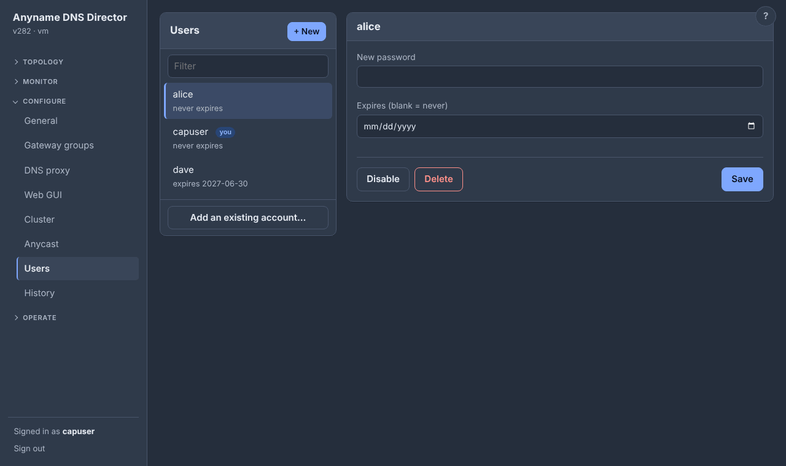

```
ddgw --users
ddgw --user-add alice --expires 2027-06-30     # asks for the password
ddgw --user-passwd alice
ddgw --user-expiry alice --expires never
ddgw --user-grant bob                          # an account that already exists joins the group
ddgw --user-revoke bob                         # leaves the group; the account is kept
ddgw --user-del alice
```

**The rules.**

- Names are 1–32 lower-case letters, digits, `_` or `-`.
- Passwords go to `chpasswd` on its standard input, never on a command line.
- *Add user* never touches an account that already exists. **Add an existing account…** (`--user-grant`) puts one in the group with `usermod -aG` and, on the other nodes, adds it where it exists and creates it with the same password hash where it does not.
- **Disable** (`--user-revoke`) takes any member out with `gpasswd -d` and keeps the account. It is refused for yourself, for the last account, and for one that is a member only as its primary group.
- Only members of the group can be changed. `root` is never listed or changeable, and neither the signed-in user nor the last account that can sign in can be deleted.
- Any member can manage the others, which is the same power they already have over the daemon. Every change is logged with who made it. The installer adds the user who ran it to the group.

**In a cluster, every change applies to every node.** Add, delete, password and expiry are made on the node you are on and sent to the others over the cluster channel as the password *hash*; the password itself never leaves the node that received it. The reply says on how many nodes the change was applied and names any that were not (a node that was down misses the change, and the CLI exits with 2). To bring such a node in line, set the password again (that re-sends the whole account and creates it where it is missing), or repeat `--user-del` (a node where the account is already gone accepts it). A node never takes over an account that already exists there outside the GUI group.

**A node that joins a cluster gets the cluster's accounts.** Right after joining, it copies the GUI-group accounts (name, password hash, expiry) from the node it joined through. An account that already exists on the new node is left exactly as it is, and accounts with no password are not copied. If that fails, the join still succeeds and the log says so; set a password again to send it.

## Config history

Every change to the configuration, whether from the GUI, the CLI, a cluster sync or a hand edit of the file, is stored as a version in `/var/lib/ddgw/versions` (one JSON file each; the newest 200 are kept). A version records when it happened, who made it (`alice`, `cli:root`, `file edit`, `cluster sync` and so on) and a one-line summary such as `DNS settings: probe_interval_ms 5000 → 7777`. Secrets (keys) never appear in summaries, and identical saves are not recorded again.

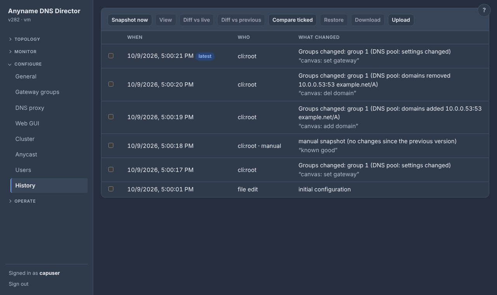

```
ddgw --versions                         # list
ddgw --version-diff 1790827200558       # that version → live config
ddgw --version-diff A..B                # two versions
ddgw --version-snapshot --note "before the VIP change"
ddgw --version-restore 1790827179815    # applies it; the live config is saved first
ddgw --version-export [ID] > ddgw.conf  # download
ddgw --config-import ddgw.conf          # validate and apply a file
```

In the GUI, the History tab lets you view a version, diff it against the live config, the previous version or two selected ones, restore, download, upload and snapshot. A snapshot note can only be given on the command line. In a cluster, restoring changes the shared part through the primary, like any other edit.

## The GUI certificate

`web.cert_file` and `web.key_file` take precedence, and are re-read when the files change, so a renewal needs no restart. Without them you can manage the certificate at runtime, under Configure ▸ Web GUI or with the commands below.

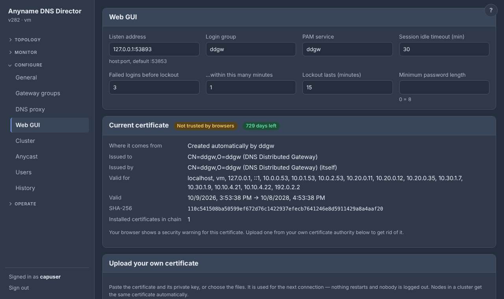

```
ddgw --tls-status
ddgw --tls-csr --cn gw.example.com --san gw.example.com,10.0.0.5   # key stays on the node
ddgw --tls-install --cert-file gw.pem --key-file gw.key             # key optional after a CSR
ddgw --tls-revert                                                   # back to self-signed
ddgw --tls-regenerate                                               # new self-signed
```

An installed certificate is checked (chain order, key match, validity, server auth, names) and served from the next connection on, with no restart and no logout. The order of precedence is: files named in the config, then the installed certificate (or the one replicated from the cluster), then self-signed. The GUI warns when the certificate expires within 30 days. The primary's certificate is copied to every member, and reverting it on the primary reverts them all.

## Clustering

Clustering is for **management only**. It keeps the settings of several Anyname nodes in step and lets you update them together, and it is independent of the AGC/AFN election. It is always on: every node is the primary of a cluster of one until it joins another. The only settings are:

```
"cluster": {"listen": ":53854", "self": "10.0.0.5:53854"}
```

`self` is the address the other nodes use to reach this node. Open TCP **53854** between the nodes.

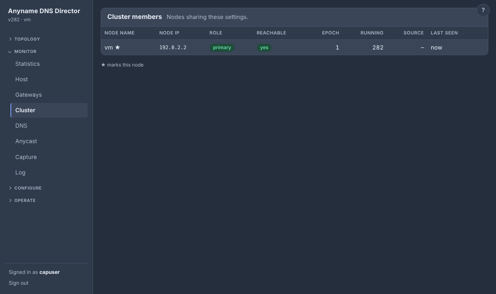

### How nodes reach each other

Nodes are reached by **every address they have**, not by one name. `self`, the host name, and all the node's IPv4 and IPv6 addresses (link-local and loopback excluded) go into the join code and are shared between members. The joining node tries them in order until one answers, and every later request tries the IP address that last worked first, then the rest.

IP addresses are tried before names, and a name is looked up for at most 2 seconds. Each node saves the addresses its peers report about themselves with the member list, so cluster traffic keeps working while DNS is down (the DNS gateway being paused on every node, say), and also right after a restart. Addresses are re-read at every sync, so a changed IP is picked up on its own.

### Joining and roles

One node is the **primary** and the rest are **replicas**. A new node is the primary of a cluster of one. To join:

1. On any member, run `ddgw --cluster-token`. It prints a join code (single use, valid for one hour).
2. On the new node, run `ddgw --cluster-join 'ddgw-join-v1:…'`. In the GUI, use Cluster tab ▸ Create join code / Join.

Joining replaces the new node's *shared* settings with the cluster's, after saving a snapshot of what it had.

### What is shared and what is per node

**Shared** settings are the DNS block and, per group, `group_id`, `name`, `vip4`, `vip6`, `more_vip4`, `more_vip6`, `key`, `lb_method`, `hello_ms`, `hold_ms`, `max_afns` and `neighbors` (the unicast list: every node's address; each node skips its own). **Per node** are the interface, priority, weight, preempt, the log level, and the web and cluster blocks.

You can edit anywhere. A change to shared settings made on a replica is forwarded to the primary, validated there, and replicated to everyone within the sync interval (5 seconds). A group added on the primary appears on replicas with the primary's interface and priority as a starting point.

### The node picker

In a cluster, the GUI has a drop-down at the top right to configure and monitor any member from the node you are logged in to. Requests are relayed over the cluster channel and recorded as `user via node`. Every page follows the picked node, including Cluster (leave, promote, join code, sync), Upgrade (upload, update now) and Configure ▸ General ▸ Upgrade (auto-update); only the sign-in is always on the node you logged in to. Uploads through another node are limited to 5 MB.

### Security between nodes

Nodes authenticate each other with a pinned per-node identity certificate (SHA-256 from the join code) and an HMAC over every request using the cluster secret, with timestamps and a replay cache. The cluster port is not the GUI port and is not affected by GUI certificates.

### Promotion, removal and the epoch

**Promotion is explicit.** If the primary is gone for good, run `ddgw --cluster-promote` on the replica you want; the others follow. Nothing promotes itself, so a network split cannot silently create two primaries, and a primary that sees a higher epoch becomes a replica.

The **epoch** (shown on the Cluster page) is the counter that says which node is the primary. It starts at 1 and goes up by one on every `--cluster-promote`, and at no other time. Members follow the primary with the highest epoch; a returning old primary at a lower epoch is ignored, and two different claims at the same epoch are refused.

To manage members: `--cluster-remove ADDR` drops a member (it resets itself to a cluster of one when it next hears from the cluster), `--cluster-unremove` allows it back, `--cluster-leave` leaves from the node itself, and `--cluster-sync` syncs now.

### Members on different subnets

Members may sit in different subnets; the cluster only needs them to reach each other's cluster port. A gateway, however, runs on a node only if that node's interface has an address inside the gateway's VIP subnet for every family the gateway has, because the election runs on that network. IPv4 is always checked. IPv6 is checked when the interface has a global (non link-local) address, so globally addressed v6 gateways are protected too, while a node with only link-local v6 is let through.

A node without such an address does not start that gateway. It shows grey ("not running here — no address in the gateway's subnet"), is not counted as serving it by the update check, and starts it by itself within seconds of getting an address there. It stays a full cluster member and still takes shared settings and updates. A node that is already running a gateway when its address changes is not stopped. If the VIP prefix differs from the prefix the node has on the same link, the node is held back: give the node an address in the VIP prefix.

### How many members?

There is no member limit. Measured on one 2-core host with real daemons on loopback: 40 members joined in about 40 ms each. A settings change made on any member, primary or replica, reached all 40 within about one sync interval (5 seconds by default). The Cluster page answered in under 15 ms. Five members frozen (not refusing, just silent) were marked unreachable within seconds, did not slow the others, and caught up when resumed. Real networks add latency this loopback test cannot show.

A hand edit of the config file on a *replica* is not a shared edit and is overwritten by the primary's next sync; use the GUI or CLI there.

## Monitoring

The Monitor section of the GUI has pages for statistics, the host, packet capture and the log. Each has a command-line equivalent, and in a cluster each follows the node picked in the Node menu at the top right.

### Statistics

Monitor ▸ Statistics (or `ddgw --stats`) shows what the DNS proxy has answered:

- the total number of queries and how they ended (No Error, Server Failure, NX Domain, Refused, and dynamic DNS Updates), and the **QPS** (queries per second in the last finished interval, with the peak of the range under it; click it to draw the rate in the chart),
- the number of different clients,
- a line chart over time (hover for the values, click a name in the legend to hide a line),
- donuts for record type and transport (UDP and TCP), and
- the top clients (with the reverse-DNS name once it is known) and the top domains.

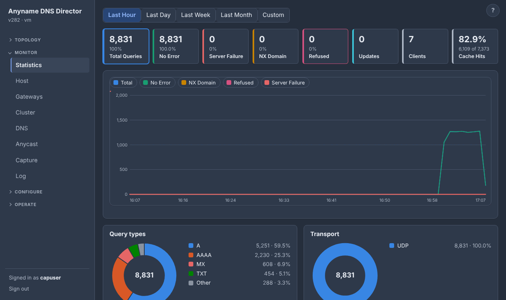

The range is Last Hour, Last Day, Last Week, Last Month, or a custom start and end. The proxy does not block or serve zones itself, so there are no Blocked or Authoritative figures; cache hits have their own tile.

**Drilling down.** Click a tile (No Error, Server Failure, NX Domain, Refused) to limit the chart, the donuts and the top lists to that kind of answer, for example to see which domains get NXDOMAIN and who asks for them. Total Queries clears it. Click a client to list the domains it asked for, or a domain to list the clients that asked for it; this combines with the tiles.

**Answering a name yourself.** Right-click a name in Top domains ▸ **Block** adds a NODATA row (any client, that exact name) at the top of the Policy-Based Resolution table and saves it, so the proxy answers that name itself from then on and no longer asks the servers (to answer NXDOMAIN or REFUSED instead, change the row on Configure ▸ DNS proxy ▸ Resolution). The statistics still count the answer under its kind. A name that already has such a row shows a 🚫, and its menu item reads **Unblock**, which removes the row. **Rewrite…** next to it (a rewritten name shows a ✏️ and its item reads **Remove rewrite**) asks what to answer the name with (an address, records such as `A 10.5.5.5; TTL 300` or `CNAME host.example.com`, or another name to ask the servers for) and adds that as a row (any client, that exact name) at the top of the table; change or delete it on Configure ▸ DNS proxy ▸ Resolution.

**Silencing a client.** Right-click a client in Top clients ▸ **Block** (a client that is blocked, and a domain that has such a row of its own, have a 🚫 after the name, and its item reads **Unblock**, which removes that row) puts a NODATA row for that client (any name) at the top of the table, so nothing it asks reaches the servers any more and it gets no answers.

**Scanning a client.** Right-click a client ▸ **Scan** runs nmap on the node you are looking at (`-Pn -F -sV -O`, the 100 commonest ports with service and OS detection, at most two minutes; two scans at a time). When it is done the client's tooltip shows a short summary: whether the host is up, its operating system, the MAC address and its maker, and the open ports with the service and version on each (twelve at most). nmap is a prerequisite the installer adds; without it the scan says so.

**Clearing the statistics.** **Clear** (next to the range buttons) forgets the counts and top lists of the node, or of every node when the Node menu says Cluster, and rewrites `stats.json.gz` at once.

**Names and whois.** Client names come from a PTR lookup that asks the DNS servers Anyname forwards to first (through the pools, so it works even when this machine's own `/etc/resolv.conf` points at nothing useful) and only then this machine's resolver and hosts file. A client with no name is asked again after 2 minutes, and a name is kept for 10.

Hovering a client shows its reverse-DNS names and, from its regional registry (found through whois.iana.org), the address block, name, organization, country and origin AS (none for private addresses). Hovering a domain shows its **whois** data (registrar, registrant when not redacted, dates, name servers), preceded by the first IPv4 and IPv6 address of the name. Whois is fetched only on the first hover, by the daemon on the picked node (TCP port 43, through whois.iana.org to the registry), and cached for a day. That sends the domain name or address, and nothing else, to the registry; a node without outbound port 43 shows "not reachable". The registered name is the last two labels (three under common second-level suffixes such as co.uk), a heuristic rather than the public suffix list. `--whois NAME|ADDRESS` prints the same.

**How long it is kept.** The counters are kept for **30 days**. They live in memory (about 30 MB for a small network, 65 MB at most) and are saved to `stats.json.gz` in the state directory every 5 minutes and when Anyname stops, and read back at start-up, so a restart or an update does not empty them. The time Anyname was not running is a gap, and "counting since" is the very first start. The file is gzip-compressed JSON, mode 0600, and holds client addresses and the names they asked for; delete it, with Anyname stopped, to forget them.

Top lists are collected in 10-minute steps for the last day and in hourly steps beyond that, keeping the busiest 300 clients and 600 domains per step (the rest count as "(others)"), so a flood of random names cannot use up memory.

**In a cluster.** Each node counts its own queries and has its own file; nothing is shared. Pick a member in the top-bar Node menu to see its statistics, or **Cluster** (its last entry, on Statistics and Host only) to see every node's numbers added together (`--all-nodes` on the command line).

```
ddgw --stats
ddgw --stats --stats-rcode nxdomain
ddgw --stats --stats-client 192.0.2.7        (what that client asked for)
ddgw --stats --stats-domain example.com      (who asked for it)
ddgw --whois example.com                     (registration data, from its registry)
ddgw --stats --stats-range 1d
ddgw --stats --stats-range 30d
ddgw --stats --all-nodes                     (every cluster node's numbers added together)
```

### The memory guard

The statistics, the host history and the answer cache all live in memory. Every 30 seconds Anyname looks at how much memory the machine is using. That is the figure the Host page shows: what programs hold, caches excluded; in a container with a memory limit, the container's use against its limit, whichever is higher.

At **85%** or more it drops the **oldest data**. Each round removes the oldest tenth of the time span the statistics and the host history cover (top lists, per-minute counters and host minutes alike, so they stay consistent) and a tenth of the answer cache (the least recently used answers). It then hands the memory back to the system and measures again, up to 5 rounds per check, until use is below the limit. If it is still above, the next check carries on.

Newer data always outlives older data, and the newest hour of statistics and host history is never dropped. That hour is tiny, and a machine short of memory for another reason should not lose its recent history too. Cuts are made at whole hours so the top lists and the counters go together.

Each time it drops something, the log says so (WARN), and the Statistics and Host pages (and `ddgw --stats`, `ddgw --host`) show a line with the count, the time and what was dropped. What is dropped is gone from the saved file too after the next save.

The limit is the environment variable `DDGW_MEMORY_LIMIT_PERCENT` of the daemon (1–99, default 85); there is no other switch. It can only drop what Anyname itself holds (at most about 100 MB), so if something else fills the machine, it will keep trimming and cannot fix that.

### Host

Monitor ▸ Host (or `ddgw --host`) shows how busy the machine is: **CPU**, **memory**, **disk** (space used per filesystem, and how busy the busiest disk was) and **network** (traffic in and out of the real interfaces, and each link's use when the driver reports its speed).

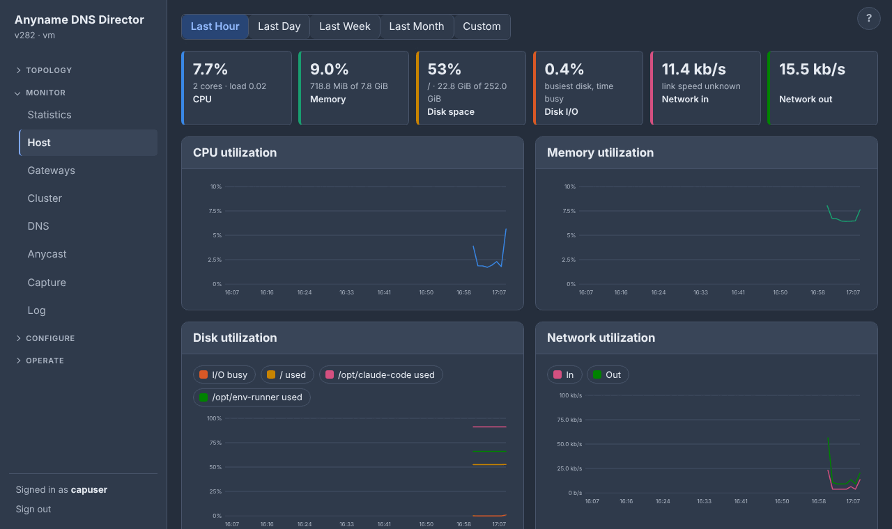

The daemon samples `/proc` and `/sys` every 10 seconds and keeps per-minute averages and peaks for **30 days** (about 4 MB in memory; saved with the Statistics file, so a restart keeps them). Tiles show the latest sample, four charts follow the range (Last Hour, Day, Week, Month or custom; hover for value and peak), and two tables list the filesystems and network interfaces. In a cluster the Node menu picks the member. Loopback, ddgw's own `ddgwN.M` links, container and bridge plumbing, and bridge or bond ports are left out of the network totals.

```
ddgw --host
ddgw --host --host-range 1d
ddgw --host --all-nodes                      (the cluster as one machine)
```

With **Cluster** chosen in the Node menu (or `--all-nodes`), the nodes are added together. Network rates, load averages, memory, swap, disk sizes and cores are summed; CPU is averaged over all the cores; memory and each filesystem are taken per byte of the whole; disk-busy is the mean. A peak is the busiest node's (the network's is the sum of the nodes' peaks, an upper bound). A node that cannot answer is named and left out.

### Capture

Monitor ▸ Capture (or `ddgw --capture`) is a `tcpdump` on any node of the cluster, or on all of them at once. It only listens: nothing is sent and nothing is changed. It uses a raw socket (no libpcap), so it needs only the privileges the daemon already has, and it does nothing until you press Start.

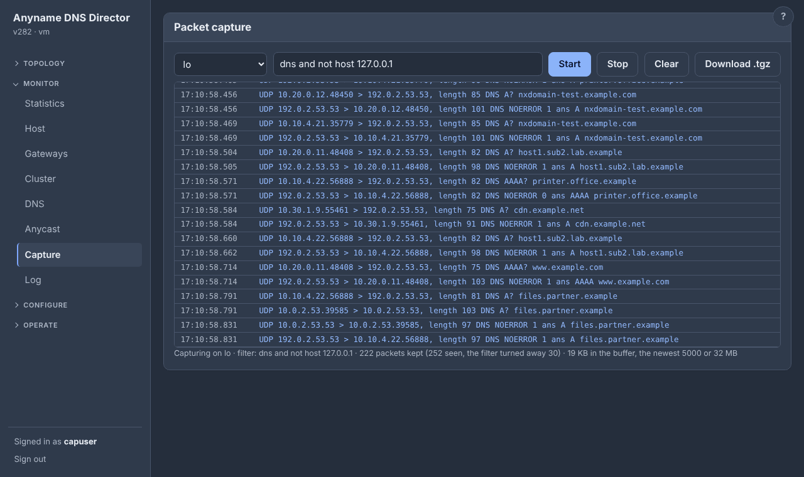

**One node** (the Node menu picks it). Choose an interface (a gateway's is marked; the virtual-MAC `ddgwN.M` interfaces are listed too), optionally a filter, and Start. The newest packets are listed live, one line each, with TCP flags, DNS names and answers and, for ARP and IPv6 neighbor discovery, the Ethernet addresses they were sent from and to, so a virtual MAC that is announced but not the one that answers shows at once. The buffer holds the newest 5000 packets or 32 MB. **Download .tgz** saves it as an archive with one `.pcap` in it, for Wireshark. A node has one capture of its own: starting another replaces it.

**Every node.** Choose **Cluster** in the Node menu, an interface (every node needs one of that name), a filter, and 5, 10, 30 or 60 seconds. All nodes capture at the same moment into a buffer of their own (so nobody's Capture page is disturbed) and keep their newest packets (about 4 MB each). **Download .tgz** gives one `.pcap` per node (this node's ends in `-this-node`), a `summary.txt`, and an `errors.txt` naming any node that could not capture and why (a node on a version without capture says so). One capture of this kind runs at a time. It is the way to see whether what one node sent is what another received.

**The filter** is a small version of the tcpdump language, applied in the daemon before a packet is kept:

- `host`, `src host`, `dst host`, `net 10.0.0.0/24`
- `port 53`, `src port`, `dst port`, `portrange 50-60`
- `tcp`, `udp`, `icmp`, `icmp6`, `arp`, `ip`, `ip6`, `dns` (port 53)
- `ether host 00:1a:7c:01:02:00` (also `src` and `dst`)
- joined with `and`, `or`, `not` and brackets; a protocol before host, net or port narrows it (`tcp port 53`).

Addresses only, no names. A filter that is not understood is refused when the capture starts. The filter runs in the daemon, not in the kernel, so a very busy interface still costs the daemon every packet; keep captures short.

```
ddgw --capture-interfaces
ddgw --capture eth0 --capture-seconds 10 --capture-filter "host 10.20.0.205 and port 53"
ddgw --capture eth0 --capture-file /tmp/eth0.pcap
ddgw --capture eth0 --capture-seconds 30 --all-nodes --capture-file /tmp/cluster.tgz
```

Without `--capture-file` the packets are printed (the first 500); with `--all-nodes` a file is required. Every start is logged with the name of the user who made it.

### Log

Monitor ▸ Log (or `ddgw --log`) shows the daemon's log and filters it by words (every word must appear), by level, by time range and by line count, with the matches marked. **Live** mode follows the newest line, and **Download** saves what is on screen. With the Node menu the page shows any member's log. `--log` without `--log-lines` prints the whole matching log.

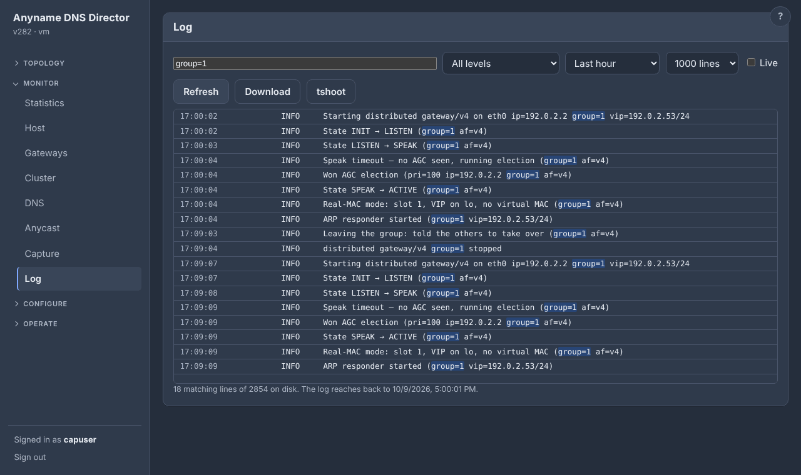

The text is the same that goes to stderr (the system journal under systemd). Anyname also keeps it in `ddgw.log` in the state directory (`/var/lib/ddgw`, root-only), rotated at 2 MB with the two previous files kept, so it survives restarts and needs no journal access. Besides the usual events, it logs server up and down changes and each domain that starts or stops answering on a server, so one failing domain shows even while the server stays up.

**tshoot** (Monitor ▸ Log ▸ tshoot, or `ddgw --tshoot [--all-nodes]`) downloads one `.tgz` with what is needed to find out why something does not work, from every node:

- the log (newest 20000 lines), the configuration and its versions;
- cluster, gateway, DNS, BGP, anycast, virtual-MAC and update state, and host numbers;
- addresses, links, routes, rules, neighbors, ARP, sockets, the ARP and routing sysctl settings, firewall rules, and FRR's BGP and BFD output;
- service status, the journal and the kernel log tail;
- 8 seconds of ARP and neighbor-discovery traffic per gateway interface (always; `--tshoot-capture` is still accepted and does nothing);
- a dump of every goroutine of the daemon (`ddgw/goroutines.txt`: what it is busy with, for a node that is up but stuck). `kill -USR1 $(pidof ddgw)` writes the same dump to standard error (`journalctl -u ddgw`), for a daemon whose pages and cluster port do not answer.

Passwords, the gateway key, tokens, join codes and private keys are removed (each node's `README.txt` says how many), and other programs' command lines are not included. It is read-only, and a node that cannot be reached has a note in the bundle.

```
ddgw --tshoot --all-nodes                # ddgw-tshoot-HOST-TIME.tgz, every node
ddgw --tshoot --tshoot-file /tmp/t.tgz   # this node only
ddgw --log --log-min warn --log-since 6h
ddgw --log --log-grep "server 192.0.2.53" --log-lines 200
```

## Operating a node

The Operate section of the GUI is for actions on a node: Node (controller, maintenance, host power), Cluster, Anycast and Upgrade. With the Node menu, each page acts on any member.

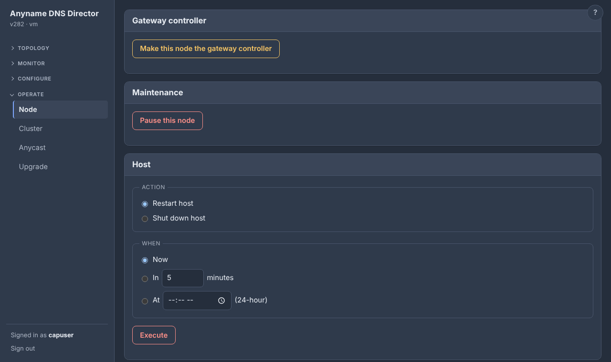

### Make this node the gateway controller

Operate ▸ Node (or `ddgw --assert-agc`) asks the current controller to hand the shared address to this node. The node takes the role first (the VIP on its macvlan, announced) and only then asks the old controller to step down. The old controller steps down in place: it keeps its own virtual MAC, the MACs it covers and its DNS up (it only stops answering ARP and neighbour solicitations and moves the VIP onto `lo`), and releases a MAC it no longer needs after a few seconds.

When a controller stops (a restart, an update, **Pause this node**), it tells the group twice, and the node that takes over announces the MAC it inherits again and again for a couple of seconds, so the last word at the switch is the new owner's. A controller that dies is noticed after the hold time, as before. To prefer a node permanently, raise its priority and turn on preemption in Settings.

### Maintenance: pause this node

Operate ▸ Node ▸ *Maintenance* (or `ddgw --node-pause`, `--node-resume`, `--node-status`) pauses every gateway on the node in one step. It resigns, stops answering DNS and stops probing, and the other nodes carry the traffic. Nothing is shut down.

The flag (`node_paused` in the config file) is local to the node, never replicated, and survives restarts of Anyname and of the host. Resuming brings the gateways back once their DNS servers answer. A gateway you paused on its own stays paused after the node resumes. With the Node menu, the page pauses any member, so to send all traffic to one node (to benchmark it, say), pause the others instead of shutting them down.

```
ddgw --node-pause
ddgw --node-resume
ddgw --node-status
```

### Restart or shut down the host

Operate ▸ Node ▸ *Host* (or `ddgw --power`) restarts or shuts down the whole host: now, in 1–10080 minutes, or at a time of day. A scheduled action is kept by the operating system (`shutdown(8)`, so it survives a restart of Anyname), shows on the page, and can be cancelled. It needs `shutdown` (systemd or sysvinit-compatible) on the host.

An action started *now* is refused when this node is the only member serving one of its gateways (the same check updates use). The GUI asks whether to go ahead anyway, and the CLI needs `--yes`. The check is made when you ask, not at a scheduled time. A stopping controller announces that it is leaving, so another member takes over at once.

```
ddgw --power restart --in 10
ddgw --power shutdown --at 02:30
ddgw --power status
ddgw --power cancel
```

## Upgrading a running cluster

Upload a release archive (`ddgw_vN.tgz` or `.zip`, the same one you would install from) on the Upgrade tab, or with `ddgw --update-upload FILE`. The node checks it (safe extraction, module `ddgw`, integer `VERSION`), keeps the source under `/var/lib/ddgw/update/source` and offers it to its peers.

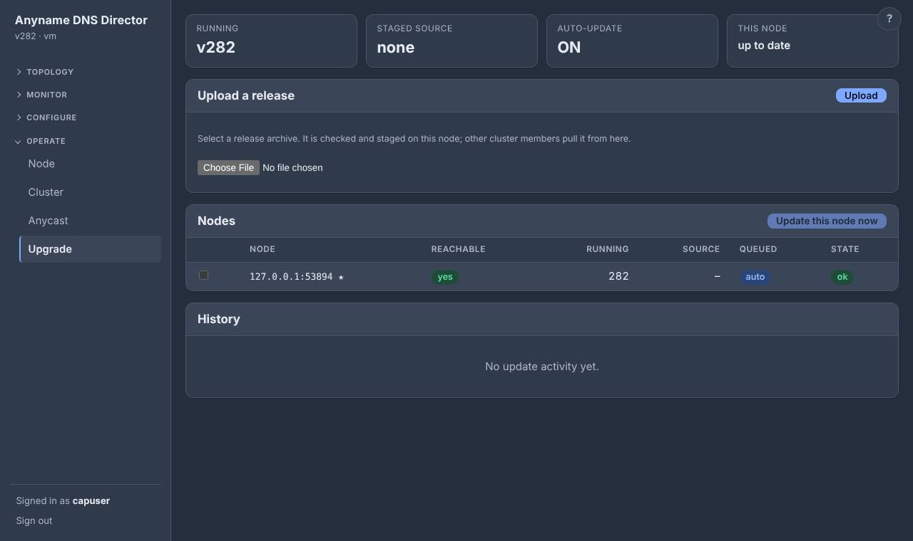

```
ddgw --update-status
ddgw --update-apply                 # build and install on this node now
ddgw --update-push all              # ask nodes (or ADDR,ADDR) to update
ddgw --update-auto on               # every node follows the newest source
ddgw --update-cancel all
ddgw --update-history
```

### How a node updates

Each node that is asked pulls the source from the peer that has the newest one and **builds it natively** (the Go toolchain, gcc and the PAM headers, which is what `install.sh` sets up). It checks the result (version number, PAM linked), keeps the old binary as `/var/lib/ddgw/update/ddgw.prev`, swaps it in and re-executes itself.

A new binary that does not stay up is rolled back automatically (three boot attempts; it is confirmed after 60 seconds), and the failure is shown in the Upgrade tab. The queue and the auto-update setting are cluster-wide and live on the primary. Run it under a supervisor that restarts the process; the unit does (`Restart=always`).

### One node at a time, and only while the gateways stay served

Nodes update one at a time, and **only while the gateways stay served**. A node holds back its update until every gateway it is serving is also being served by another reachable member, so a node that is still recovering from its own update keeps the next one waiting; the Upgrade page says why. `--update-apply` on one node refuses in the same situation unless you add `--yes` (the GUI asks).

A node that is not clustered, is the only member, or serves nothing is never held back (a lone node restarts briefly; nothing could cover for it). The same goes for a gateway that no other member can serve because they are all on another subnet (sites that each have their own gateway): waiting for them would be for ever, so that gateway no longer holds the update back.

**Paused nodes update first.** A node that is paused serves nothing, so it can restart at any time. A member that is held back only because it is the sole one serving a gateway (the others are paused or down) does not make the rest wait for it: the paused nodes update one after another, then you resume one and the last node follows. The held node says why on the Upgrade page.

### No outage while a node restarts

After building, the node does not restart until another member has been serving each of its gateways for at least 15 seconds (the same check that gates a rolling update; `--update-apply --yes` skips it). A stopping node says so: a controller announces that it is leaving and the best remaining node becomes controller at once, and a forwarder tells the controller, which covers its virtual MAC immediately instead of a hold time later.

Whoever covers a MAC also announces it on the wire (an ARP probe or IPv6 DAD solicitation from that MAC, which changes no host's neighbour cache). A switch or a Linux bridge keeps a MAC on its old port until something transmits from the new one, and clients cached on that MAC would lose their answers for about 3 seconds. A returning node announces its MAC once it can answer, and the controller hands the MAC back a moment later. Forwarders, and a controller for the MACs it covers, repeat the announcement every 2 seconds, so a switch entry that went stale is corrected in seconds. On start-up a gateway joins only after its DNS pool answers.

Measured with two real nodes in network namespaces on a bridge and a client querying the VIP every 100 ms, pinned to the restarting node's MAC: restarting the controller or a forwarder caused no failed queries.

## Build from source

```
# the Go module is in source/; docs/ has the changelog
cd source
go build -o ddgw .          # no third-party dependencies
go test -race ./...
./ddgw --config ./ddgw.conf
```

## License

Anyname is free software under the GNU General Public License, version 3 (see `LICENSE` next to this file).
